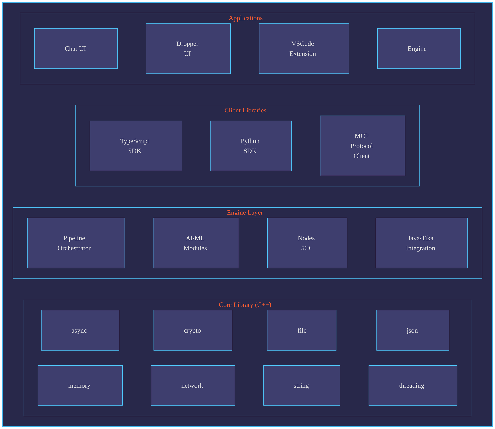

# RocketRide Data Processing Engine

[](https://opensource.org/licenses/MIT)
[](https://nodejs.org/)

A high-performance, modular data processing engine with extensible pipeline nodes, AI/ML capabilities, and cross-platform client libraries.

## Architecture



## Prerequisites

| Component   | Version | Purpose                        |
| ----------- | ------- | ------------------------------ |
| **Node.js** | 18+     | Build system, client libraries |

Everything else -- pnpm, C++ toolchains, Python, Java/Maven -- is downloaded and configured automatically by the build system.

## Quick Start

```bash
git clone https://github.com/rocketride-org/rocketride-server.git
cd engine-new
./builder build
```

The `builder` script configures the environment, downloads a pre-built engine when available (or compiles from source), and builds all modules. See the [build system documentation](docs/README-builder.md) for per-module builds, commands, and options.

## Project Structure

```text
engine-new/
├── apps/                       # Runnable applications
│   ├── engine/                 # Main engine executable (C++)
│   ├── chat-ui/                # Chat web interface (React)
│   ├── dropper-ui/             # File dropper interface (React)
│   └── vscode/                 # VSCode extension
├── packages/                   # Reusable libraries
│   ├── server/                 # C++ server components
│   │   ├── engine-core/        # Core library (apLib)
│   │   └── engine-lib/         # Engine library (engLib)
│   ├── client-typescript/      # TypeScript SDK
│   ├── client-python/          # Python SDK
│   ├── client-mcp/             # MCP Protocol client
│   ├── ai/                     # AI/ML modules
│   ├── tika/                   # Java/Tika integration
│   ├── java/                   # JDK & Maven tooling
│   ├── vcpkg/                  # C++ package manager
│   └── shared-ui/              # Shared UI components
├── nodes/                      # Pipeline nodes (Python)
│   └── src/                    # Node implementations
├── scripts/                    # Build system
├── docs/                       # Documentation
├── test/                       # Integration tests
├── testdata/                   # Test fixtures and data
├── examples/                   # Example projects
├── dist/                       # Build outputs
└── build/                      # Build intermediates
```

## Documentation

- [Build system](docs/README-builder.md)
- [Engine](docs/README-engine.md)
- [Client libraries](docs/README-clients.md) -- [TypeScript](docs/README-typescript-client.md), [Python](docs/README-python-client.md), [MCP](docs/README-mcp-client.md)
- [Pipeline nodes](docs/README-nodes.md)
- [Node test framework](docs/README-node-testing.md)

## Contributing

We welcome contributions. Please see our [Contributing Guide](CONTRIBUTING.md) for details.

1. Fork the repository
2. Create a feature branch (`git checkout -b feature/amazing-feature`)
3. Commit your changes (`git commit -m 'Add amazing feature'`)
4. Push to the branch (`git push origin feature/amazing-feature`)
5. Open a Pull Request

## Security

For security concerns, please see our [Security Policy](SECURITY.md) or email security@rocketride.ai.

## License

This project is licensed under the MIT License -- see the [LICENSE](LICENSE) file for details.
