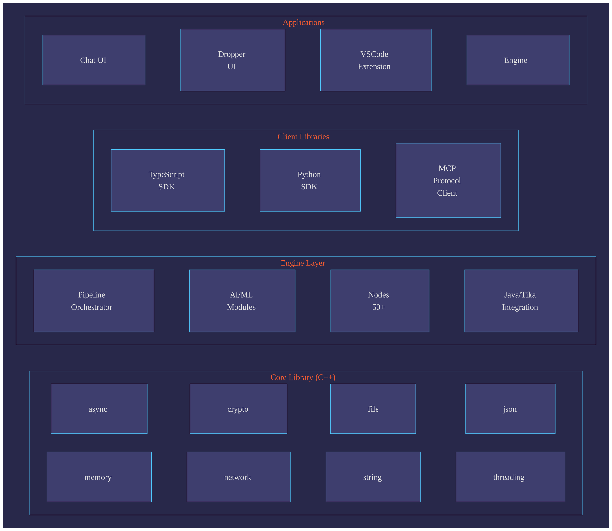

# RocketRide Data Processing Engine

[](https://opensource.org/licenses/MIT)
[](https://nodejs.org/)
[](https://python.org/)
[](https://isocpp.org/)

A high-performance, modular data processing engine with extensible pipeline nodes, AI/ML capabilities, and cross-platform client libraries.

## Table of Contents

- [Overview](#overview)
- [Features](#features)
- [Architecture](#architecture)
- [Prerequisites](#prerequisites)
- [Installation](#installation)
- [Building](#building)
- [Project Structure](#project-structure)
- [Components](#components)
- [Pipeline Nodes](#pipeline-nodes)
- [Client Libraries](#client-libraries)
- [Configuration](#configuration)
- [Docker](#docker)
- [Development](#development)
- [Testing](#testing)
- [Contributing](#contributing)
- [License](#license)

## Overview

RocketRide Engine is a modular data processing platform designed for enterprise-scale data operations. It provides:

- **High-Performance Core**: Written in C++ for maximum efficiency
- **Extensible Pipeline System**: Build custom data workflows with 50+ pre-built nodes
- **AI/ML Integration**: Built-in support for LLMs, embeddings, and vector databases
- **Cross-Platform Clients**: TypeScript, Python, and MCP client libraries
- **Visual Pipeline Editor**: VSCode extension for visual workflow design

## Features

### Data Processing
- Document parsing (PDF, Office, images, audio, video)
- Text extraction and OCR
- Content chunking and preprocessing
- Named Entity Recognition (NER)
- Data anonymization/PII redaction

### AI & Machine Learning
- Integration with major LLM providers (OpenAI, Anthropic, Google, AWS Bedrock, Ollama)
- Text and image embeddings
- Vector database support (Chroma, Pinecone, Milvus, Qdrant, Weaviate)
- RAG (Retrieval-Augmented Generation) workflows

### Connectivity
- Cloud storage (OneDrive, SharePoint, Google Drive, S3, Azure Blob)
- Enterprise systems (Confluence, Slack, Jira)
- Databases (MySQL, PostgreSQL, Astra DB)
- Web scraping (Firecrawl)

### Developer Experience
- Unified build system with interactive progress
- Hot-reload development mode
- Comprehensive TypeScript types
- VSCode extension for visual pipeline editing

## Architecture



## Prerequisites

### Required

| Component | Version | Purpose |
|-----------|---------|---------|
| **Node.js** | 18+ | Build system, client libraries |
| **pnpm** | 8+ | Package management |
| **Python** | 3.10+ | Nodes, AI modules, Python client |
| **Git** | 2.30+ | Source control |

### For C++ Compilation (Optional)

| Platform | Compiler | Build Tools |
|----------|----------|-------------|
| **Windows** | MSVC 2019+ | CMake 3.19+, Ninja |
| **macOS** | Xcode CLT / Clang 12+ | CMake 3.19+, Ninja |
| **Linux** | GCC 10+ / Clang 12+ | CMake 3.19+, Ninja |

### For Java Components (Optional)

| Component | Version | Purpose |
|-----------|---------|---------|
| **JDK** | 17+ | Tika document parsing |
| **Maven** | 3.9+ | Java build |

> **Note**: Java and C++ tools are automatically downloaded and configured by the build system if not present.

## Installation

### Quick Start

```bash
git clone https://github.com/rocketride-org/rocketride-server.git
cd engine-new
./builder build
```

The `builder` script configures the environment, downloads a pre-built engine when available (or compiles from source), and builds all modules.

For platform-specific prerequisites and detailed setup, see:

- [Windows](docs/setup/windows.md)
- [macOS](docs/setup/osx.md)
- [Linux](docs/setup/linux.md)

## Building

```bash
./builder build
```

This configures the environment, downloads a pre-built engine when available (or compiles from source), and builds all modules. Use `./builder build --sequential` if parallel builds hit resource limits.

For per-module builds, commands, modules reference, examples, and build output layout, see the [Builder documentation](docs/builder/README.md#user-reference-commands-modules-and-output).

## Project Structure

```
engine-new/
├── apps/                       # Runnable applications
│   ├── engine/                 # Main engine executable (C++)
│   ├── chat-ui/               # Chat web interface (React)
│   ├── dropper-ui/            # File dropper interface (React)
│   └── vscode/                # VSCode extension
├── packages/                   # Reusable libraries
│   ├── server/                # C++ server components
│   │   ├── engine-core/       # Core library (apLib)
│   │   └── engine-lib/        # Engine library (engLib); include/ has public headers for external consumers
│   ├── client-typescript/     # TypeScript SDK
│   ├── client-python/         # Python SDK
│   ├── client-mcp/            # MCP Protocol client
│   ├── ai/                    # AI/ML modules
│   ├── tika/                  # Java/Tika integration
│   ├── java/                  # JDK & Maven tooling
│   ├── vcpkg/                 # C++ package manager
│   ├── model_server/          # GPU model server (Python)
│   └── shared-ui/             # Shared UI components (used by vscode)
├── nodes/                      # Pipeline nodes (Python)
│   └── src/                   # Node implementations
├── examples/                   # Example projects
│   └── console-chat/          # Console chat example
├── scripts/                    # Build system
│   ├── build.js               # Main build orchestrator
│   └── lib/                   # Build utilities
├── docs/                       # Documentation
├── docker/                     # Docker configurations
├── dist/                       # Build outputs
└── build/                      # Build intermediates
```

## Components

### Engine (C++)

The core engine provides high-performance data processing:

- **apLib (engine-core)**: Foundational library with async I/O, cryptography, memory management
- **engLib (engine-lib)**: Pipeline execution, node management, document processing
- **engine**: Main executable with WebSocket API

### Client Libraries

#### TypeScript SDK

```typescript
import { RocketRideClient } from 'rocketride';

const client = new RocketRideClient({
  auth: process.env.ROCKETRIDE_APIKEY!,
  uri: 'https://cloud.rocketride.ai',
});
await client.connect();
const { token } = await client.use({ filepath: './pipeline.json' });
const result = await client.send(token, 'Hello, pipeline!');
```

#### Python SDK

```python
from rocketride import RocketRideClient

async with RocketRideClient(uri='wss://cloud.rocketride.ai', auth='your-api-key') as client:
    result = await client.use(filepath='pipeline.json')
    token = result['token']
    await client.send(token, 'Hello, pipeline!')
```

### UI Applications

- **Chat UI**: Interactive chat interface for RAG workflows
- **Dropper UI**: Drag-and-drop file processing interface
- **VSCode Extension**: Visual pipeline editor with debugging

## Pipeline Nodes

Nodes are modular Python components that extend the engine's capabilities:

### Cloud Storage
| Node | Description |
|------|-------------|
| `onedrive` | Microsoft OneDrive |
| `sharepoint` | SharePoint Online |
| `google` | Google Drive |
| `remote` | S3, Azure Blob, GCS |

### LLM Providers
| Node | Description |
|------|-------------|
| `llm_openai` | OpenAI GPT models |
| `llm_anthropic` | Anthropic Claude |
| `llm_gemini` | Google Gemini |
| `llm_bedrock` | AWS Bedrock |
| `llm_ollama` | Local Ollama models |
| `llm_mistral` | Mistral AI |
| `llm_perplexity` | Perplexity AI (Sonar, web search) |
| `llm_deepseek` | DeepSeek models |
| `llm_xai` | xAI (Grok) |
| `llm_vision_mistral` | Mistral Vision (multimodal) |

### Vector Databases
| Node | Description |
|------|-------------|
| `chroma` | Chroma DB |
| `pinecone` | Pinecone |
| `milvus` | Milvus |
| `qdrant` | Qdrant |
| `weaviate` | Weaviate |
| `astra_db` | Astra DB (DataStax) |
| `vectordb_postgres` | PostgreSQL pgvector |
| `atlas` | MongoDB Atlas Vector Search |

### Processing
| Node | Description |
|------|-------------|
| `ocr` | Optical character recognition |
| `audio_transcribe` | Audio to text |
| `embedding_openai` | OpenAI embeddings |
| `embedding_transformer` | Local transformer embeddings |
| `embedding_image` | Image embeddings |
| `summarization` | Text summarization |
| `anonymize` | PII redaction |
| `ner` | Named Entity Recognition |
| `preprocessor_langchain` | LangChain text splitters |
| `preprocessor_llm` | LLM-based preprocessing |
| `vectorizer` | Text vectorization |

### Collaboration
| Node | Description |
|------|-------------|
| `atlassian` | Confluence, Jira |
| `slack` | Slack workspaces |

## Configuration

### Engine Configuration

The engine reads configuration from `user.json` (copy from `user.template.json`):

```json
{
  "server": {
    "host": "0.0.0.0",
    "port": 8080
  },
  "logging": {
    "level": "info"
  },
  "python": {
    "path": "auto"
  }
}
```

### Pipeline Definition

Pipelines are defined in JSON format:

```json
{
  "name": "Document Processing",
  "nodes": [
    {
      "id": "source",
      "type": "sharepoint",
      "config": {
        "siteUrl": "https://company.sharepoint.com"
      }
    },
    {
      "id": "embed",
      "type": "embedding_openai",
      "input": "source"
    },
    {
      "id": "store",
      "type": "chroma",
      "input": "embed"
    }
  ]
}
```

## Docker

### Build Images

```bash
# Build engine image
pnpm docker:engine

# Build EaaS (Engine as a Service) image
pnpm docker:eaas
```

### Run with Docker

```bash
# Run engine
docker run -p 8080:8080 engine-new

# Run with volume mount
docker run -p 8080:8080 -v /data:/data engine-new
```

### Docker Compose

```yaml
version: '3.8'
services:
  engine:
    image: engine-new
    ports:
      - "8080:8080"
    volumes:
      - ./data:/data
      - ./config:/config
```

## Development

### Development Mode

```bash
# Start UI in dev mode (hot reload)
./builder chat-ui:dev
# or: ./builder dropper-ui:dev

# Alternatively, from the app directory:
cd apps/chat-ui && pnpm dev
```

### Adding a New Node

1. Create directory in `nodes/src/<node_name>/`
2. Implement required interfaces:

```python
# nodes/src/my_node/__init__.py
from .my_node import MyNode
from .IInstance import IInstance
from .IGlobal import IGlobal

# nodes/src/my_node/my_node.py
class MyNode:
    def __init__(self, config):
        self.config = config
    
    def process(self, input_data):
        # Process data
        return output_data
```

3. Add `services.json` for node definition
4. Add `requirements.txt` for dependencies

### Code Style

```bash
# Lint JavaScript/TypeScript
pnpm lint
pnpm lint:fix

# Format code
pnpm format
pnpm format:fix

# Python linting (in node directories)
ruff check .
ruff check --fix .
```

## Testing

### Run All Tests

```bash
# Run all tests
pnpm test

# Run specific module tests
./builder server:test              # C++ tests
./builder client-typescript:test   # TypeScript tests
./builder client-python:test       # Python tests
```

### C++ Tests

```bash
# Build and run C++ tests
./builder server:test

# Run specific test
cd build && ctest -R "aptest" -V
```

### Python Tests

```bash
# Run pytest
cd nodes && python -m pytest src/ -v

# Run with coverage
python -m pytest --cov=src
```

## API Reference

### WebSocket API

The engine exposes a WebSocket API at `ws://host:port/api`:

```typescript
// Connect
ws.send(JSON.stringify({
  type: 'connect',
  auth: { token: 'your-token' }
}));

// Run pipeline
ws.send(JSON.stringify({
  type: 'pipeline.run',
  pipeline: 'path/to/pipeline.json',
  params: { /* ... */ }
}));

// Subscribe to events
ws.send(JSON.stringify({
  type: 'subscribe',
  channel: 'pipeline.progress'
}));
```

### REST API
π
```bash
# Health check
curl http://localhost:8080/health

# Pipeline status
curl http://localhost:8080/api/pipeline/status

# List nodes
curl http://localhost:8080/api/nodes
```

## Troubleshooting

### Common Issues

**Build fails with vcpkg error**
```bash
# Clean vcpkg and rebuild
./builder server:clean
rm -rf build/vcpkg
./builder server:build
```

**Python module not found**
```bash
./builder build
```

**TypeScript compilation errors**
```bash
# Clean and rebuild
./builder client-typescript:clean
./builder client-typescript:build
```

### Logs

- Engine logs: `logs/engine.log`
- Build logs: Check terminal output or `build/build.log`

## Contributing

We welcome contributions! Please see our [Contributing Guide](CONTRIBUTING.md) for details.

1. Fork the repository
2. Create a feature branch (`git checkout -b feature/amazing-feature`)
3. Commit your changes (`git commit -m 'Add amazing feature'`)
4. Push to the branch (`git push origin feature/amazing-feature`)
5. Open a Pull Request

## Security

For security concerns, please see our [Security Policy](SECURITY.md) or email security@rocketride.ai.

## License

This project is licensed under the MIT License - see the [LICENSE](LICENSE) file for details.

## Acknowledgments

- [vcpkg](https://github.com/microsoft/vcpkg) - C++ package management
- [Apache Tika](https://tika.apache.org/) - Document parsing
- [listr2](https://github.com/cenk1cenk2/listr2) - Interactive task lists

---

<p align="center">
  <b>Built with ❤️ by <a href="https://rocketride.ai/">RocketRide</a></b>
</p>
