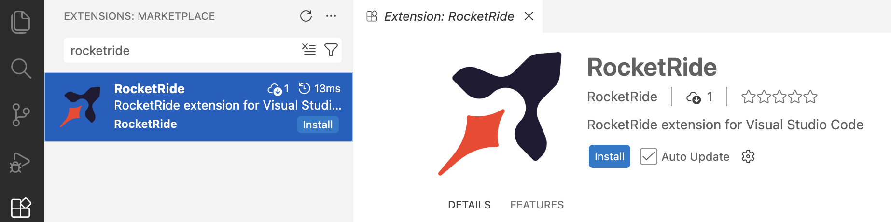

<p align="center">
  
</p>

<p align="center">
  <a href="https://github.com/rocketride-org/rocketride-server/actions/workflows/ci.yml"></a>
  <a href="https://opensource.org/licenses/MIT"></a>
  <a href="https://nodejs.org/"></a>
  <a href="https://discord.gg/9hr3tdZmEG"></a>
</p>

RocketRide is a high-performance data processing engine built on a C++ core with a Python-extensible node system. With 50+ pipeline nodes, native AI/ML support, and SDKs for TypeScript, Python, and MCP, it lets you process, transform, and analyze data at scale — entirely on your own infrastructure.

## Key Capabilities

- **Stay in your IDE** — Build, debug, test, and scale heavy AI and data workloads with an intuitive visual builder in the environment you're used to. Stop using your browser.
- **High-performance C++ engine** — Native multithreading. No bottleneck. Purpose-built for throughput, not prototypes.
- **Multi-agent workflows** — Orchestrate and scale agents with built-in support for CrewAI and LangChain.
- **50+ pipeline nodes** — Python-extensible, with 13 LLM providers, 8 vector databases, OCR, NER, PII anonymization, and more.
- **TypeScript, Python & MCP SDKs** — Integrate pipelines into native applications or expose them as tools for AI assistants.
- **One-click deploy** — Run on Docker, on-prem, or RocketRide Cloud (👀*coming soon*). Our architecture is made for production, not demos.

## ⚡ Quick Start

1. Install the extension for your IDE. Search for RocketRide in the extension marketplace:

   <p align="center">
     
   </p>

   <sub>[Not seeing your IDE? Open an issue](https://github.com/rocketride-org/rocketride-server/issues/new) · [Download directly](https://open-vsx.org/extension/RocketRide/rocketride)</sub>

2. Click the RocketRide (🚀) extension in your IDE

3. Deploy a server — you'll be prompted on how you want to run the server. Choose the option that fits your setup:

   - **Local (Recommended)** — This pulls the server directly into your IDE without any additional setup.
   - **On-Premises** — Run the server on your own hardware for full control and data residency. Pull the image and deploy to Docker or clone this repo and [build from source](CONTRIBUTING.md#getting-started).
   - **RocketRide Cloud** (👀*coming soon*) — Managed hosting with our proprietary model server. No infrastructure to maintain.

4. Create a `.pipe` file and start building

## 🔧 Building your first pipe

1. All pipelines are recognized with the `*.pipe` format. Each pipeline and configuration is a JSON object - but the extension in your IDE will render within our visual builder canvas.

2. All pipelines begin with source node: _webhook_, _chat_, or _dropper_. For specific usage, examples, and inspiration 💡 on how to build pipelines, check out our [guides and documentation](https://docs.rocketride.org/)

   - [Advanced RAG](https://docs.rocketride.org/examples/advanced-rag-pipeline/)
   - [Video Frame Grabber](https://docs.rocketride.org/examples/video-key-frame-grabber/)
   - [Audio Transcription](https://docs.rocketride.org/examples/audio-transcription-simple/)

3. Connect input lanes and output lanes by type to properly wire your pipeline. Some nodes like agents or LLMs can be invoked as tools for use by a parent node as shown below:

<p align="center">
  
</p>

4. You can run a pipeline from the canvas by pressing the ▶️ button on the source node or from the `Connection Manager` directly.

5. View all available and running pipelines below the `Connection Manager`. Selecting running pipelines allows for in depth analytics. Trace call trees, token usage, memory consumption, and more to optimize your pipelines before scaling and deploying.

6. 📦 Deploy your pipelines to RocketRide.ai cloud or run them on your own infrastructure.

   - **Docker** — Download the RocketRide server image and create a container. Requires [Docker](https://docs.docker.com/get-docker/) to be installed.

     ```bash
     docker pull ghcr.io/rocketride-org/rocketride-engine:latest
     docker create --name rocketride-engine -p 5565:5565 ghcr.io/rocketride-org/rocketride-engine:latest
     ```

   - **RocketRide Cloud** (👀*coming soon*) — Managed hosting with our proprietary model server and batched processing. The cheapest option to run AI workflows and pipelines at scale (seriously).

7. Run your pipelines as standalone processes or integrate them into your existing [Python](https://docs.rocketride.org/sdk/python-sdk) and [TypeScript/JS](https://docs.rocketride.org/sdk/node-sdk) applications utilizing our SDK.

8. Use it, commit it, ship it. 🚚

## Useful Links

- 📚 [Documentation](https://docs.rocketride.org/)
- 💬 [Discord](https://discord.gg/9hr3tdZmEG)
- 🤝 [Contributions](CONTRIBUTING.md)
- 🔒 [Security](SECURITY.md)
- ⚖️ [License](LICENSE)

---

<p align="center">Made with ❤️ in 🌁 SF & 🇪🇺 EU</p>
