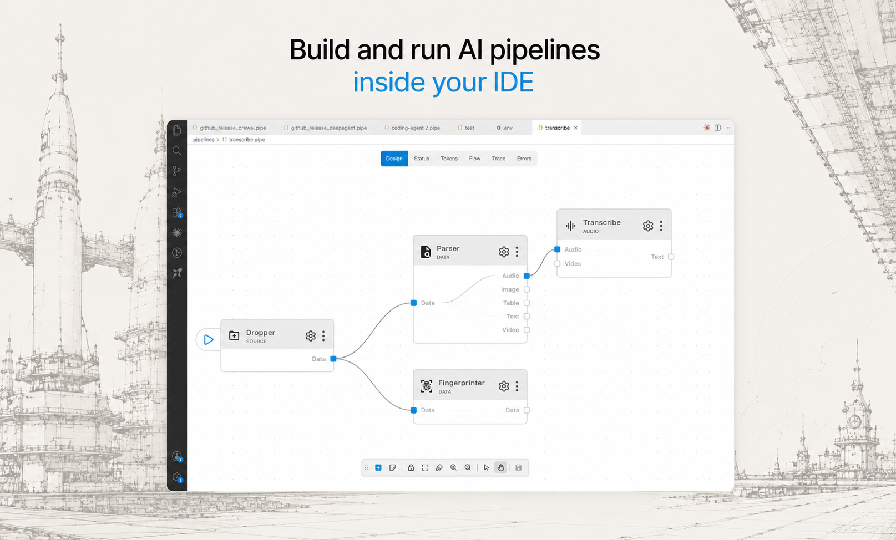
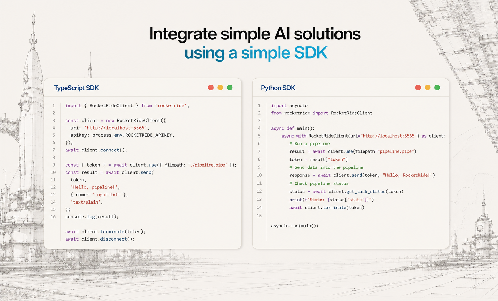
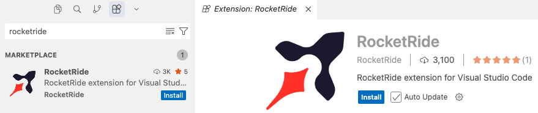

<div align="center">

  <a href="https://rocketride.org">
    
  </a>

  # RocketRide 🚀
  ### The Open Source AI Development Environment (AIDE)

  **Build, deploy, and observe production-ready AI pipelines at light speed — directly inside your IDE.**

  <p align="center">
    <a href="https://rocketride.org"><strong>Website</strong></a> •
    <a href="https://docs.rocketride.org/"><strong>Documentation</strong></a> •
    <a href="https://discord.gg/PMXrtenMsY"><strong>Community Discord</strong></a> •
    <a href="https://cloud.rocketride.ai/"><strong>RocketRide Cloud</strong></a>
  </p>

  <p>
    <a href="https://github.com/rocketride-org/rocketride-server/actions/workflows/ci.yml"></a>
    <a href="https://github.com/rocketride-org/rocketride-server/releases"></a>
    <a href="https://pypi.org/project/rocketride/"></a>
    <a href="https://www.npmjs.com/package/rocketride"></a>
    <a href="https://discord.gg/PMXrtenMsY"></a>
    <a href="LICENSE"></a>
  </p>

</div>

---

## ⚡ What is RocketRide?

**RocketRide** transforms your classic IDE into a full **AI Development Environment (AIDE)**. It provides a single harness to compose, debug, observe, and deploy AI runtimes using any model, tool, or framework — with zero vendor lock-in.

Powered by a high-throughput **multithreaded C++ engine**, RocketRide is an open-source pipeline builder equipped with **100+ nodes** spanning 15+ LLM providers, 9 vector databases, OCR, NER, and PII anonymization.

> 💡 **Everything Behind Your Agents:** RocketRide doesn't just manage agent logic — it manages the entire stack beneath them.

---

## 📸 See It in Action

| Visual Pipeline Canvas | Production SDK Integration |
| :---: | :---: |
|  |  |
| _Design, test, and trace workflows visually in VS Code._ | _Drop `.pipe` workflows directly into Python or TypeScript._ |

---

## 🚀 Quick Navigation

<table>
  <tr>
    <td width="50%" valign="top">
      <h4>💻 Run Locally</h4>
      <p>Install the extension, select <strong>Local</strong>, and execute pipelines locally with zero sign-ups.</p>
      <a href="#-quick-start"><strong>Quick Start →</strong></a>
    </td>
    <td width="50%" valign="top">
      <h4>🛠️ Your First Feature</h4>
      <p>Build a local document processor pipeline in 3 simple steps without requiring API keys.</p>
      <a href="#-your-first-ai-feature"><strong>Start Here →</strong></a>
    </td>
  </tr>
  <tr>
    <td width="50%" valign="top">
      <h4>🤝 Community & Contributing</h4>
      <p>Claim issues, build custom Python nodes, or improve core runtime components.</p>
      <a href="#-contributing"><strong>Contributing Guide →</strong></a>
    </td>
    <td width="50%" valign="top">
      <h4>☁️ Managed Hosting</h4>
      <p>Deploy your <code>.pipe</code> workflows directly onto RocketRide Cloud with zero infrastructure overhead.</p>
      <a href="#-deployment-cloud-vs-on-prem"><strong>RocketRide Cloud →</strong></a>
    </td>
  </tr>
</table>

---

## ✨ Features at a Glance

* 🎨 **Visual Pipeline Builder:** Compose workflows directly in VS Code. Saved as portable, version-controlled `.pipe` JSON files.
* ⚡ **High-Performance C++ Runtime:** Built natively with multithreading for production-grade throughput and zero bottlenecks.
* 🧩 **100+ Pre-Built Nodes:** Seamless connections for OpenAI, Anthropic, Qdrant, Pinecone, local models, OCR, NER, and chunking.
* 🤖 **Multi-Agent Orchestration:** Native support for CrewAI, LangChain, tool usage, shared memory, and agent loops.
* 🧠 **Coding Agent Integration:** Auto-detects Cursor, Claude, and other AI coding assistants to build pipelines via natural language.
* 📊 **Deep Observability:** Trace call trees, token usage, latency, and memory consumption in real time.
* 📦 **Zero-Dependency Setup:** C++ toolchains, Python virtual environments, and external runtime dependencies are automatically managed.

---

## ⚙️ Quick Start

1. **Install the IDE Extension:** Search for **RocketRide** in the VS Code Marketplace or Open VSX Registry.

   <p align="center">
     
   </p>

2. **Open RocketRide:** Click the RocketRide icon on your editor sidebar.
3. **Select Execution Engine:**
   * **Local (Recommended):** Pulls and runs the runtime engine directly inside your IDE environment.
   * **On-Premises / Docker:** Run using Docker or build directly from source:
     ```bash
     docker pull ghcr.io/rocketride-org/rocketride-engine:latest
     docker run -d --name rocketride-engine -p 5565:5565 ghcr.io/rocketride-org/rocketride-engine:latest
     ```

---

## 🛠️ Your First AI Feature

Translate concepts you already know directly into RocketRide workflows:

| Concept | Traditional Web App | RocketRide Equivalent |
| :--- | :--- | :--- |
| **Trigger** | API Endpoint / Route | **Source Node** (`webhook`, `chat`, `dropper`) |
| **Logic** | Middleware Chain | **Processing Nodes** (Python-extensible) |
| **Output** | HTTP Response | **Response Node** |
| **Config** | `Dockerfile` / `env` | `.pipe` File (Versionable JSON) |
| **Invocation** | Service Call | **Python / TypeScript SDK** |

### Step-by-Step Example

1. **Start Engine:** Follow the [Quick Start](#%EF%B8%8F-quick-start) and choose **Local**.
2. **Open Example Pipeline:** Load [`examples/document-processor.pipe`](examples/document-processor.pipe). It runs locally to extract text, perform NER, and scrub PII without external API calls.
3. **Execute via SDK:**

```bash
pip install rocketride
