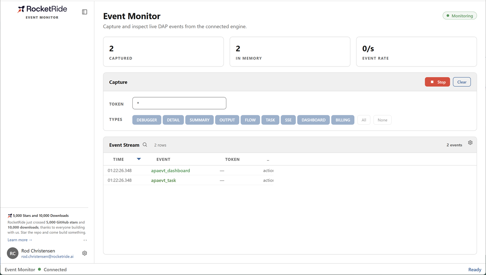

# Event Monitor

Watch the live stream of engine events in real time — subscribe to the event
categories you care about, inspect any event's full JSON payload, and export the
capture, all from one dashboard.

  

---

## What it does

Event Monitor taps the RocketRide engine's live event stream. Start a capture,
pick which event categories and which task to follow, and events flow into a
sortable grid as they happen — with running metrics and one-click inspection of
any event's body.

- **Live capture** — start/stop a subscription; events stream in as the engine emits them.
- **Filter what you see** — follow a specific task token (or `*` for all tasks) and choose the event categories to capture.
- **At-a-glance metrics** — total captured, events held in memory, and the current events/second rate.
- **Inspect any event** — click a row to open a slide-over with its metadata and the full JSON body in an interactive tree.
- **Search & export** — filter the grid and export the capture from the grid's toolbar.

---

## Event categories

| Category | Captures |
|---|---|
| **SUMMARY** | High-level task/pipeline lifecycle updates |
| **TASK** | Task-level state changes |
| **FLOW** | Node-to-node flow events |
| **DETAIL** | Fine-grained per-node detail |
| **OUTPUT** | Node output payloads |
| **DEBUGGER** | Debugger protocol traffic |
| **SSE / DASHBOARD / BILLING** | Server-sent, dashboard, and billing events |

---

## Screenshots

<!-- Add a capture from the running app here, e.g.:
      -->

_Screenshots coming soon._
