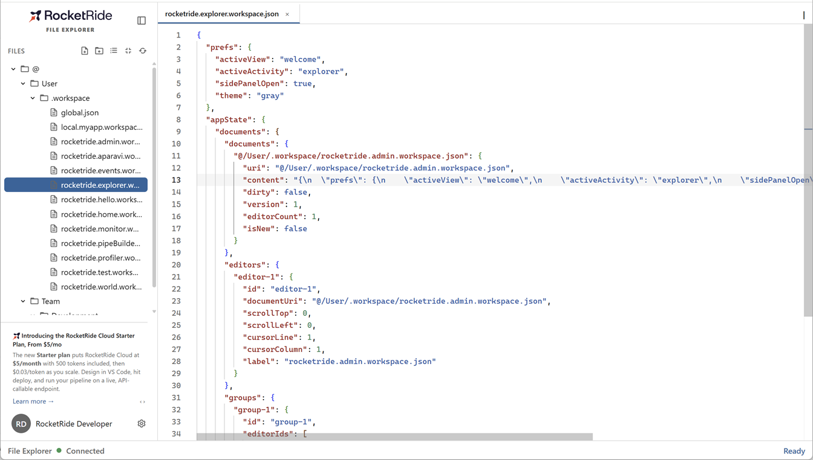

# RocketRide File Explorer

Browse, preview, and edit the files stored on your RocketRide server — right
inside the shell. Open anything from source code to spreadsheets, video, and
PDFs in a familiar tabbed, split-pane workspace, with the right viewer chosen
automatically for each file type.

  

---

## What it does

The File Explorer is your window into the RocketRide server store. A file tree
in the sidebar lists everything on the server; click a file and it opens in a
tab, rendered by the best viewer for its type — a code editor for source, a
rich preview for Markdown, an inline player for media, an interactive tree for
JSON, and more.

- **One workspace, many files** — open as many files as you like in tabs, and
  split the view to see two side by side.
- **The right viewer, automatically** — each file opens in the viewer that
  suits it, and you can always switch with **Open with…**.
- **Edit in place** — source and text files open in a full code editor; press
  **Ctrl+S** to save back to the server.
- **Bring files in and out** — drag files from your computer to upload, drag
  within the tree to move, and download anything with a click.

No configuration required — the File Explorer works against whichever
RocketRide server you're connected to. Just sign in.

---

## Supported files

| Type | Opens as | Examples |
|---|---|---|
| **Source & code** | Code editor (syntax highlighting, editable) | `.ts` `.js` `.py` `.go` `.rs` `.sql` `.sh` `.yaml` `.html` `.css` — 100+ languages |
| **JSON** | Interactive **JSON tree** inspector, or the code editor | `.json` `.jsonl` `.geojson` `.pipe` |
| **Markdown** | Rendered preview | `.md` `.markdown` `.mdx` |
| **Images** | Image viewer | `.png` `.jpg` `.gif` `.webp` `.svg` `.avif` |
| **Video** | Inline player (streamed) | `.mp4` `.webm` `.mov` `.mkv` |
| **Audio** | Inline player (streamed) | `.mp3` `.wav` `.flac` `.aac` `.m4a` |
| **PDF** | PDF viewer | `.pdf` |
| **Word documents** | Document viewer | `.docx` |
| **Spreadsheets** | Spreadsheet viewer | `.xlsx` `.xls` `.csv` |
| **Anything else** | Hex viewer | `.zip` `.bin` `.exe`, and any unknown binary |

Every file type also offers alternates under **Open with…** — for example,
view a `.json` file as a raw text file, or inspect any file's bytes in the hex
viewer.

---

## Working with files

| Action | How |
|---|---|
| **Open a file** | Click it in the sidebar tree. |
| **Open in a split view** | Use the split control on a tab to place two files side by side. |
| **Switch viewer** | Right-click a file → **Open with…**, then choose a viewer. |
| **Edit & save** | Type in the code editor and press **Ctrl+S**. |
| **Upload** | Drag files from your computer onto a folder in the tree. |
| **Move** | Drag a file or folder to a new folder in the tree. |
| **Rename / delete** | Use the file's **⋯** menu in the sidebar. |
| **New file / folder** | Use the sidebar's create actions. |
| **Download** | File **⋯** menu → **Download**. |

---

## Screenshots

<!--
  Drop captures from the running app here once available, e.g.:
  
  
-->

_Screenshots coming soon._
