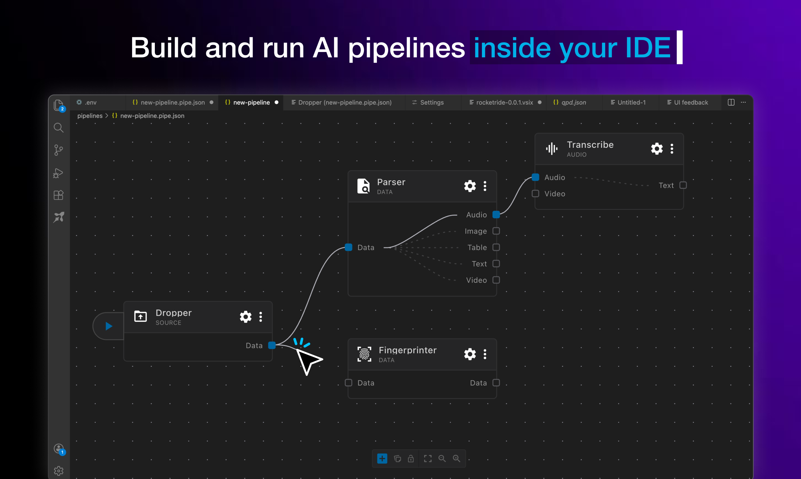
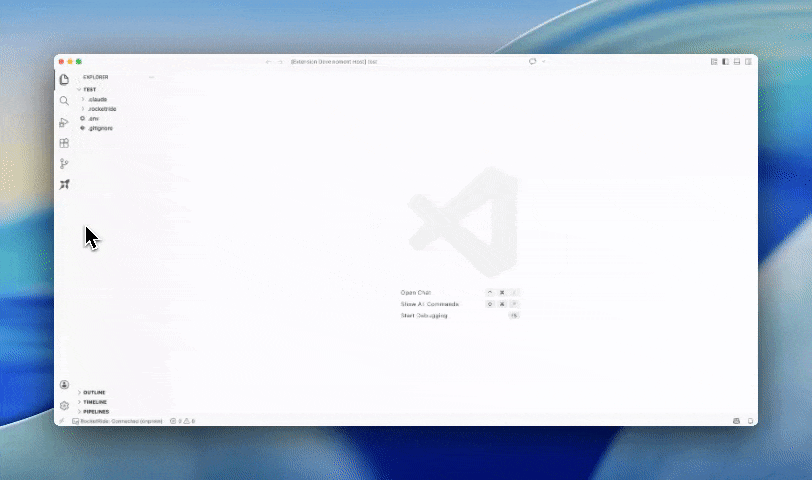

# Pipeline Builder

Design, run, and deploy AI pipelines visually — the RocketRide canvas that
turns a folder of `.pipe` files into running, observable workflows without
leaving your editor.

  

---

## What it does

Pipeline Builder is the visual front end for RocketRide pipelines. Open a
project, drop nodes onto the canvas, wire their lanes, and press play: the
pipeline runs against your connected engine and every node reports back live.

- **Build on a canvas** — add nodes from the catalog, connect data and control lanes, and edit each node's configuration in place; the `.pipe` file on disk is the source of truth.
- **Run and watch** — start a pipeline from the play bar and follow tokens, node status, and utilization as it executes.
- **Trace what happened** — open the trace view for any run to step through node-by-node events and payloads.
- **Deploy from the same screen** — publish a pipeline to the registry and point a team at a version from the deploy panel; promotion and rollback are the same pointer move.
- **Fix errors where they occur** — validation and runtime errors attach to the node that raised them.

  

---

## Where it runs

| Host | How |
|---|---|
| **VS Code** | Ships inside the RocketRide extension — open any folder with `.pipe` files. |
| **Browser** | Opens from the RocketRide shell on any engine — cloud or self-hosted. |

Pipeline Builder is one app on the RocketRide platform. For the platform
itself — engine, SDKs, cloud — see the
[RocketRide repository](https://github.com/rocketride-org/rocketride-server)
and [docs.rocketride.org](https://docs.rocketride.org/).
