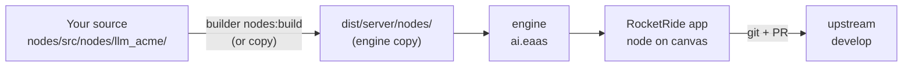
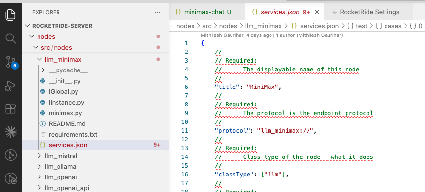
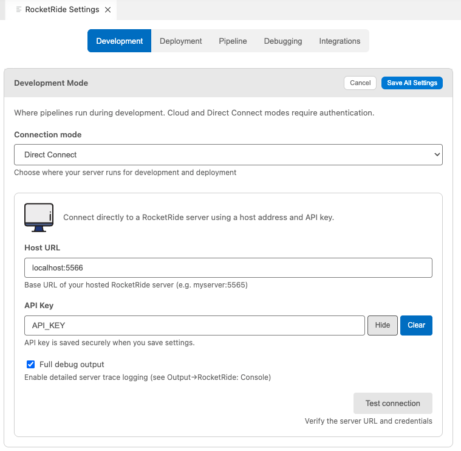
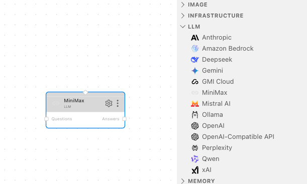
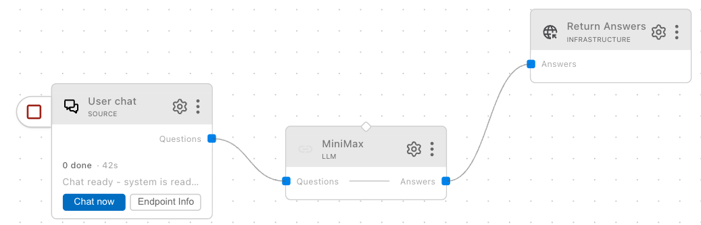

# Authoring a New Node — End‑to‑End

Take a new pipeline node from idea → local test → upstream PR. Run the steps in order. Examples show macOS; Windows/Linux paths are noted where they differ.



1. [Fork & clone](#1-fork--clone)
2. [Branch from an issue](#2-branch-from-an-issue)
3. [Create the node](#3-create-the-node)
4. [Get it into the engine](#4-get-it-into-the-engine)
5. [Run it in a pipeline](#5-run-it-in-a-pipeline)
6. [Add a minimum test](#6-add-a-minimum-test)
7. [Open a PR](#7-open-a-pr)

Background: [README-nodes.md](README-nodes.md) · [README-node-testing.md](README-node-testing.md) · [CONTRIBUTING.md](../CONTRIBUTING.md).

---

## 1. Fork & Clone

Fork `rocketride-org/rocketride-server` on GitHub, then:

```bash
git clone git@github.com:<you>/rocketride-server.git
cd rocketride-server
git remote add upstream https://github.com/rocketride-org/rocketride-server.git
git checkout develop && git pull upstream develop
```

---

## 2. Branch from an Issue

Every PR must link to an issue, and branch names must follow `<type>/RR-<issue#>-<desc>` (enforced), where `<type>` is one of `feat`, `fix`, `docs`, `chore`, `refactor`, or `hotfix`. Adding a node is a feature, so this guide uses `feat`.

Open a GitHub issue, then:

```bash
gh issue develop <issue#> --name "feat/RR-<issue#>-add-llm-acme" --checkout
```

---

## 3. Create the Node

Copy the existing node closest to what you're building, then adapt it. This guide adds a new LLM provider, **Acme**, so it starts from `llm_openai`. (Building a transform with no external API instead? Copy `dictionary` — it's the smallest full file set.)

```bash
cp -r nodes/src/nodes/llm_openai nodes/src/nodes/llm_acme
```

You now own these files:

```text
nodes/src/nodes/llm_acme/
├── __init__.py        # re‑exports IGlobal and IInstance
├── IGlobal.py         # process‑wide state (init once) — e.g. the API client
├── IInstance.py       # per‑pipeline work — read input lanes, write output lanes
├── acme_client.py     # provider SDK wrapper (rename from openai_client.py)
├── services.json      # manifest: title, lanes, profiles, shape, tests
└── requirements.txt
```

Rename `openai_client.py` → `acme_client.py`, fix its import in `IGlobal.py`, and trim `preconfig.profiles` down to the model(s) Acme actually offers.



**Edit `services.json`** — at minimum:

| Field          | Change to                                                                 |
| -------------- | ------------------------------------------------------------------------- |
| `title`        | `Acme` (the name shown in the UI)                                         |
| `protocol`     | `llm_acme://`                                                             |
| `path`         | `nodes.llm_acme`                                                          |
| `classType`    | `["llm"]` (use `["filter"]` / `["tool"]` for other node kinds)           |
| `lanes`        | Input lane(s) → output lane(s), e.g. `{"questions": ["answers"]}`         |
| `preconfig`    | Default profile + `profiles` map (keep at least `custom` and one named)   |
| `shape`        | Fields the UI renders for configuration                                   |

Then edit `IInstance.py` to do the actual work. Reference: [llm_openai/services.json](../nodes/src/nodes/llm_openai/services.json) for a full example. Full field reference: `.rocketride/docs/ROCKETRIDE_COMPONENT_REFERENCE.md`.

**✅ At this point your node exists** — `llm_acme` is fully created under `nodes/src/nodes/llm_acme/`. The remaining steps get the engine to load it so you can run it.

---

## 4. Get it into the Engine

Your node now lives in the source tree, but the engine doesn't run from there — it runs from its own copy. So before you can use the node you just created, you have to get it into the engine, then start the engine with it. Pick one:

### Option A — Rebuild (recommended, matches CI)

Requires Node 18+, pnpm 8+, Python 3.10+. One‑time: `pnpm install`.

```bash
./builder build           # first time only (~5 min; downloads prebuilt engine)
./builder nodes:build     # every code change after that (~seconds)
./dist/server/engine -m ai.eaas
```

Engine binds to `127.0.0.1:5565` by default. To use a different port: `./dist/server/engine -m ai.eaas --port 5566`, then in the app go to **Settings → Deployment**, pick **Direct Connect**, set Host URL to `localhost:5566`, API key = any non‑empty string, and click **Save All Settings**.



### Option B — Copy into the installed engine (no build)

Copy your node into the installed engine's `nodes/` folder, then quit & relaunch RocketRide.

| Platform    | Engine `nodes/` path                                     |
| ----------- | -------------------------------------------------------- |
| **macOS**   | `~/Library/Application Support/RocketRide/engine/nodes/` |
| **Windows** | `%LOCALAPPDATA%\RocketRide\engine\nodes\`                |
| **Linux**   | `~/.config/RocketRide/engine/nodes/`                     |

```bash
# macOS
cp -R nodes/src/nodes/llm_acme "$HOME/Library/Application Support/RocketRide/engine/nodes/"

# Linux
cp -R nodes/src/nodes/llm_acme "$HOME/.config/RocketRide/engine/nodes/"

# Windows (PowerShell)
Copy-Item -Recurse -Force .\nodes\src\nodes\llm_acme "$env:LOCALAPPDATA\RocketRide\engine\nodes\"
```

> Tip: `ln -s` instead of `cp -R` to skip re‑copying on every edit.

---

## 5. Run it in a Pipeline

Add your node by `protocol` to a `.pipe` file under `pipelines/` (any pipeline using `llm_openai` is a good template). Run from the builder UI or the SDK.



Run the pipeline and confirm your node produces output:



If the node doesn't show up, see [Common Gotchas](#common-gotchas).

---

## 6. Add a Minimum Test

Required for CI. Add a `test` block to `services.json` — for an LLM node the input arrives on `text` and the result comes back on the `answers` lane:

```json
"test": [
  {
    "profiles": ["custom"],
    "cases": [
      { "name": "smoke", "text": "What is 2+2?", "expect": { "answers": { "contains": "4" } } }
    ]
  }
]
```

Run: `./builder nodes:test`. Real LLM calls need a key or a mock — see [README-node-testing.md](README-node-testing.md) for the full schema and mocking.

---

## 7. Open a PR

```bash
git add nodes/src/nodes/llm_acme/
git commit -m "feat: add llm_acme pipeline node"
git push -u origin feat/RR-<issue#>-add-llm-acme

gh pr create --base develop --title "feat: add llm_acme pipeline node" \
  --body "Fixes #<issue#>

Adds \`llm_acme\` under \`nodes/src/nodes/llm_acme/\` with services.json, IGlobal/IInstance, and a smoke test."
```

Required for CI to pass:

- PR targets `develop` (not `main`)
- PR body contains `Fixes #<issue#>` (or `Closes` / `Resolves`)
- `./builder nodes:test` passes

---

## Common Gotchas

- **Changes not picked up.** Run `./builder nodes:build` (Option A) or re‑copy (Option B), then restart the engine / RocketRide.
- **`path` mismatch.** `path` in `services.json` must be `nodes.<dir_name>`.
- **Lane mismatch.** Lane names in `services.json` must match what `IInstance` reads/writes — otherwise silent no‑op.
- **Missing `custom` profile.** Without it the UI feels broken.
- **Branch name rejected.** Must match `<type>/RR-<issue#>-<desc>`. Rename: `git branch -m feat/RR-<issue#>-add-llm-acme`.
- **Pydantic crash.** Convert pydantic models with `.model_dump()` before passing to engine internals. See `ROCKETRIDE_COMMON_MISTAKES.md` (Mistake 19).

---

## License

MIT License — see [LICENSE](../LICENSE).
