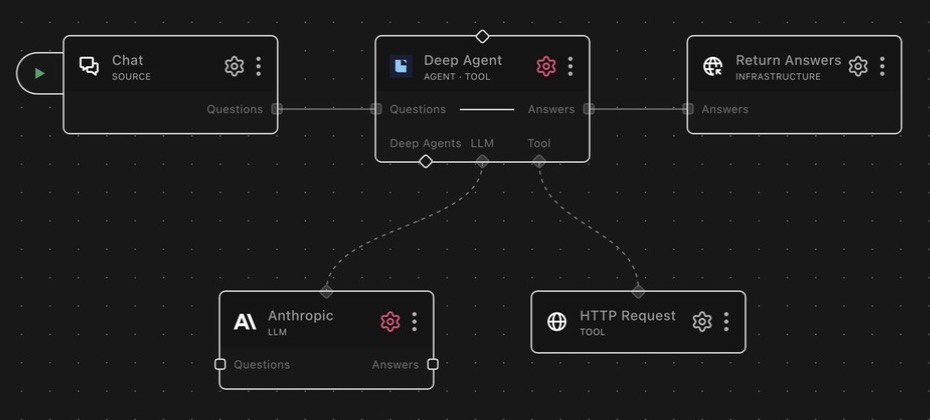

# agent_deepagent

A planning-capable RocketRide agent built on the Deep Agents library, with optional managed sub-agents for hierarchical delegation.

## About Deep Agents

Deep Agents is an open-source agent framework built on LangChain and
LangGraph. It layers the machinery long-running tasks need — upfront
planning, state that persists across steps, and long-context management — on
top of the standard tools-plus-LLM agent loop.

## What it does

Runs an agent loop via `deepagents.create_deep_agent` (built on LangChain/LangGraph), which layers strategic planning, persistent state, and long-context management on top of the standard LangChain tool-calling loop. The package ships two node variants:

- **Deep Agent** (`agent_deepagent`): the orchestrator. Consumes `questions` and produces `answers`, runs standalone with its own tools, and registers as a tool (`classType: ["agent", "tool"]`) so a parent agent can delegate to it via `<nodeId>.run_agent`.
- **Deep Agent Subagent** (`agent_deepagent_subagent`): a managed worker (`classType: ["deepagent"]`). It has no `questions` lane and cannot be invoked directly or called as a tool; it must be wired into a Deep Agent via the `deepagent` invoke channel, which delegates to it based on its `description`.

Sub-agents are optional: with none connected, the Deep Agent behaves as a standard single-agent node. Inference is routed through the host LLM channel using a JSON envelope protocol, so any LLM that can follow JSON instructions works; native function-calling support is not required. Agent lifecycle progress (tool calls, LLM calls, agent steps) is streamed as SSE `thinking` events.

## Example pipelines

**Research assistant with an HTTP tool**

`chat → agent_deepagent → response_answers`

`llm_anthropic` is wired to `llm` and `tool_http_request` to `tool`. Chat
questions reach the agent, which can call the HTTP tool before returning an
answer.

**Hierarchical team with specialists**

`webhook → agent_deepagent → response`, plus two Deep Agent Subagents on the
`deepagent` channel: a researcher (tools: `tool_exa_search`) and a coder
(tools: `tool_python`, `tool_github`), each with its own `llm`. The
orchestrator breaks the task apart and delegates each piece to the sub-agent
whose Description matches, and the plural `tool_calls` envelope lets it
delegate to several sub-agents in parallel in a single turn.

**Agent-callable research service**

A parent agent (e.g. `agent_rocketride`) with this Deep Agent connected as a
tool. With a filled-in Agent description, the parent invokes
`<nodeId>.run_agent` when it hits a question needing deep multi-step
research rather than attempting it in its own loop.

## Connections

### Deep Agent

| Channel     | Required    | Description                                                  |
|-------------|-------------|--------------------------------------------------------------|
| `llm`       | yes (min 1) | LLM used by the agent                                        |
| `tool`      | no          | Tools available to the agent (via control-plane invoke)      |
| `deepagent` | no          | Deep Agent Subagent nodes for hierarchical delegation        |

### Deep Agent Subagent

| Channel | Required    | Description                                    |
|---------|-------------|------------------------------------------------|
| `llm`   | yes (min 1) | LLM this sub-agent thinks with                 |
| `tool`  | no          | Tools available to this sub-agent              |

The sub-agent's LLM and tool channels are independent of the orchestrator's. When the orchestrator delegates, the sub-agent's LLM and tool calls are routed back through this node's own channels.

## Lanes

| Lane in     | Lane out  | Description                                     |
| ----------- | --------- | ----------------------------------------------- |
| `questions` | `answers` | Send the agent a task, receive its final answer |

Deep Agent only. The Subagent declares no lanes; it is driven by an
orchestrator, not by direct questions.

## As a tool

The Deep Agent (not the Subagent) exposes itself as an invokable tool, `<nodeId>.run_agent`, so parent agents can delegate to it in nested pipelines.

- **Input:** `{query: string, context?: object}`. `query` must be a non-empty string; `context`, when provided, is attached to the question as a `RocketRide.agent.tool_context.v1` JSON payload.
- **Output:** `{content, meta, stack}`.

When `agent_description` is non-empty it is included in the tool's description so parent agents can select this agent correctly.

## Configuration

Both variants are steered the same way: by default you add **Instructions**,
and turning on **Advanced Mode** swaps them for direct prompt fields. The
field-level details:

### Description (Subagent)

The most important field on a sub-agent. The orchestrating Deep Agent reads
**only this text** when deciding which sub-agent gets a task — it cannot see
the sub-agent's prompt, tools, or LLM. Keep it specific and action-oriented:
"Searches the web and summarizes findings with sources" gets routed work;
"helper agent" never gets picked. If a sub-agent sits idle while the
orchestrator does everything itself, fix this field first.

### Agent description (Deep Agent)

The same idea one level up: when the Deep Agent is used as a tool by a parent
agent, this text is folded into the `run_agent` tool description so the
caller can decide when to invoke it. Leave it blank if nothing calls this
agent as a tool.

### Instructions, System prompt & Advanced Mode

With Advanced Mode **off** (the default), you steer the agent by adding
Instructions — each non-empty line is appended, on its own line, to the
built-in system prompt that already handles planning and state. With Advanced
Mode **on**, the Instructions list is replaced by the raw prompt fields
(`system_prompt`, and `agent_description` on the orchestrator) for full
control; a blank `system_prompt` falls back to the built-in default. Stay in
default mode unless the built-in prompt is actively in your way — replacing
it discards the planning behavior that makes Deep Agents worth choosing.

### Require tool call

Smaller or weaker planning models occasionally **narrate** a multi-step tool
chain in prose instead of actually calling the tools, producing a
plausible-looking but ungrounded answer. When this toggle is on, any run that
produces an answer without invoking at least one tool fails with a
`RocketRide.agent.guard.v1` error instead of delivering the ungrounded text.
Off by default; enable it for determinism-critical pipelines. The guard
counts real tool invocations only — internal/local reads (for example the
wave agent's `memory.peek`) do not satisfy it.

## Notes

### Tool calling protocol

The host LLM is opaque to the driver, so tool calling uses a JSON envelope protocol: each LLM call is prefixed with a system preamble instructing the model to output exactly one JSON object in one of three shapes:

- Single tool call: `{"type":"tool_call","name":"server.tool","args":{...}}`
- Parallel tool calls: `{"type":"tool_calls","calls":[{"name":"...","args":{...}}, ...]}`
- Final answer: `{"type":"final","content":"..."}`

The plural `tool_calls` form dispatches all entries concurrently (LangGraph's async ToolNode fans them out via `asyncio.gather`), which is what unlocks parallel sub-agent delegation in a single turn.

Up to 3 attempts are made when the LLM produces malformed JSON, and a tolerant parser extracts the first balanced JSON object, rescuing responses wrapped in markdown fences, followed by trailing prose, or stacked with a stray second object (a common failure mode: a duplicate call or hallucinated `final` appended after a `tool_call`).

Host tool descriptors are converted to LangChain `BaseTool` instances with typed Pydantic input schemas built from each tool's JSON-Schema `inputSchema`; tool execution and LLM calls are bridged off the event loop via `asyncio.to_thread` so concurrent calls do not serialize.

### Hierarchical delegation

Connect one or more Deep Agent Subagent nodes to the `deepagent` invoke channel to turn the Deep Agent into an orchestrator. On each run:

1. The orchestrator fans out a `describe` invoke to every connected Subagent node.
2. Each sub-agent returns its name, description, system prompt, instructions, and a reference to its own engine channels.
3. The orchestrator builds a `deepagents.middleware.subagents.SubAgent` record per descriptor, wiring each sub-agent's LLM and tools to its own channels, and passes them to `create_deep_agent(subagents=...)`.
4. The orchestrator's LLM gains a `task(description, subagent_type)` tool it calls to delegate work. Each sub-agent runs in its own `AgentContext` that inherits the run metadata, so SSE events route back to the same logical run.

Give each sub-agent its own LLM, tools, and a clear `description`: the description is the only signal the orchestrator uses to choose a delegate. A Subagent can be connected to multiple orchestrators simultaneously; each orchestrator independently includes it in its own hierarchical run. A `describe` failure on one node is logged and skipped, not fatal to the run.

### Observability

The driver emits SSE `thinking` events throughout a run: host-tool discovery count, sub-agent collection count, agent start, per-tool start/completion/error (with tool name and input length), LLM call start/completion/error, and agent thinking/done transitions.

## Upstream docs

- [Deep Agents documentation](https://docs.langchain.com/oss/python/deepagents/overview)
- [LangChain documentation](https://python.langchain.com/docs/)

---

<!-- ROCKETRIDE:GENERATED:PARAMS START -->
<!-- Generated by nodes:docs-generate. Do not edit by hand. -->

## Schema

### Deep Agent (`services.agent.json`)

| Field | Type | Description | Default |
|---|---|---|---|
| `advanced_mode` | `boolean` | **Advanced Mode** When enabled, replace the Instructions list with direct Agent Description and System Prompt fields for full control. | `false` |
| `agent_description` | `string` | **Agent description** What does this agent do? Describe its purpose and capabilities, this helps parent agents select and invoke it correctly. | `""` |
| `instructions` | `array` | **Instructions** Additional instructions to guide the agent. Each line is appended to the system prompt. |  |
| `require_tool_call` | `boolean` | **Require tool call** Require the agent to invoke at least one tool before answering. When on, a run that answers without calling any tool fails with a guard error. Use for determinism-critical pipelines where an ungrounded or narrated answer must never be delivered. Off by default. | `false` |
| `system_prompt` | `string` | **System prompt** Instructions that define this agent's role and behaviour. Leave blank to use the default. | `""` |

### Deep Agent Subagent (`services.subagent.json`)

| Field | Type | Description | Default |
|---|---|---|---|
| `advanced_mode` | `boolean` | **Advanced Mode** When enabled, replace the Instructions list with a direct System Prompt field for full control. | `false` |
| `description` | `string` | **Description** The orchestrator reads this description to decide when to delegate to this sub-agent. Keep it specific and action-oriented, this is the only signal the orchestrator uses to pick a sub-agent. | `""` |
| `instructions` | `array` | **Instructions** Additional instructions to guide this sub-agent. Each line is appended to the system prompt. |  |
| `system_prompt` | `string` | **System prompt** Instructions that define this sub-agent's role and behaviour. Leave blank to use the default. | `""` |

## Dependencies

- `deepagents`
- `langchain`
- `langchain-core`
- `pydantic`

## Source

[<svg viewBox="0 0 16 16" width="15" height="15" fill="currentColor" aria-hidden="true" style="vertical-align:-0.15em;margin-right:0.35em"><path d="M8 0C3.58 0 0 3.58 0 8c0 3.54 2.29 6.53 5.47 7.59.4.07.55-.17.55-.38 0-.19-.01-.82-.01-1.49-2.01.37-2.53-.49-2.69-.94-.09-.23-.48-.94-.82-1.13-.28-.15-.68-.52-.01-.53.63-.01 1.08.58 1.23.82.72 1.21 1.87.87 2.33.66.07-.52.28-.87.51-1.07-1.78-.2-3.64-.89-3.64-3.95 0-.87.31-1.59.82-2.15-.08-.2-.36-1.02.08-2.12 0 0 .67-.21 2.2.82.64-.18 1.32-.27 2-.27.68 0 1.36.09 2 .27 1.53-1.04 2.2-.82 2.2-.82.44 1.1.16 1.92.08 2.12.51.56.82 1.27.82 2.15 0 3.07-1.87 3.75-3.65 3.95.29.25.54.73.54 1.48 0 1.07-.01 1.93-.01 2.2 0 .21.15.46.55.38A8.013 8.013 0 0016 8c0-4.42-3.58-8-8-8z"/></svg> View source](https://github.com/rocketride-org/rocketride-server/tree/develop/nodes/src/nodes/agent_deepagent)
<!-- ROCKETRIDE:GENERATED:PARAMS END -->
