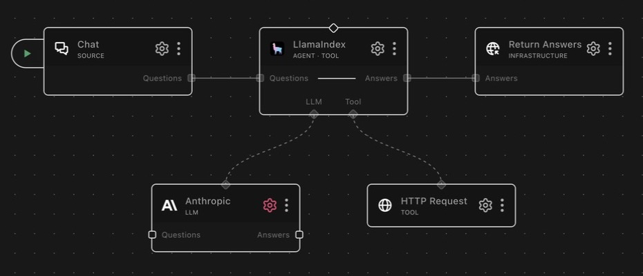

# agent_llamaindex

A RocketRide agent node that answers questions with a LlamaIndex ReAct loop —
reasoning step by step and calling connected tools until it reaches an answer.

## About LlamaIndex

LlamaIndex is an open-source framework for building LLM applications over your
own data. It is best known for its retrieval and indexing toolkit and for
ReAct-style agents, which interleave reasoning with tool use so a model can
gather what it needs before answering.

## What it does

Takes a question on the `questions` lane, reasons about it step by step, calls
whatever tools are connected to it, and emits the final answer on the `answers`
lane. Because the reasoning loop is plain text (the model writes
`Thought / Action / Action Input`), it works with **any** LLM that can follow
the format — native function-calling support is not required, which makes it a
good fit for local or smaller models. It can also be invoked as a tool by a
parent agent, so it works as a specialist inside a larger agent hierarchy.

## Example pipelines

**Answer questions using an HTTP tool**

`chat → agent_llamaindex → response_answers`

`llm_anthropic` is wired to the `llm` channel and `tool_http_request` to
`tool`. A question arrives on chat, the agent decides when to call the API,
reads the response, and returns a grounded answer.

**Research agent over your own documents**

`chat → agent_llamaindex → response_answers`

Swap the HTTP tool for `store_qdrant`: the agent searches the vector store on
demand rather than every question being forced through retrieval, then answers
from what it found.

**Specialist inside a larger agent**

An `agent_rocketride` node with this node connected on its `tool` channel. Fill
in **Agent description** so the parent knows when to delegate; it calls
`<nodeId>.run_agent` and gets the sub-agent's answer back.

## Connections

| Connection | Required | Description                                             |
| ---------- | -------- | ------------------------------------------------------- |
| `llm`      | yes      | LLM the agent reasons with                              |
| `tool`     | no       | Tools available to the agent during its reasoning loop  |

Without tools the node still works — it becomes a single-shot question
answerer. Tools are what make the ReAct loop worth using.

## Lanes

| Lane in     | Lane out  | Description                                      |
| ----------- | --------- | ------------------------------------------------ |
| `questions` | `answers` | Send a question, receive the agent's final answer |

## As a tool

When connected to a parent agent, the node exposes one function:

| Function             | Description                                        |
| -------------------- | -------------------------------------------------- |
| `<nodeId>.run_agent` | Run this agent on a query and return its answer    |

Input is `{query: string, context?: object}` — `query` must be a non-empty
string. The optional `context` object reaches the sub-agent as a context entry
of type `RocketRide.agent.tool_context.v1`. Output is `{content, meta, stack}`,
where `stack` is the list of reasoning steps taken. When invoked as a tool the
answer returns to the caller instead of going out on the `answers` lane.

The configured **Agent description** is prepended to this function's
description, so it is what a parent agent reads when choosing between
sub-agents.

## Configuration

The default profile needs nothing set — connect an LLM and the node runs. The
three fields shape *how* it behaves: what a parent agent is told about it, what
guidance its prompt carries, and whether ungrounded answers are allowed.

### Agent description

Only matters when this node is connected to a parent agent as a tool. The
parent reads **this text alone** when deciding whether to delegate — it cannot
see the instructions, the tools, or the LLM. Write it specific and
action-oriented: "Searches internal documentation and answers with citations"
gets picked; "helper agent" never does. Leave it blank if nothing calls this
agent as a tool.

### Instructions

Each line is appended to the built-in ReAct prompt, which already handles the
reasoning scaffolding. Use it for domain rules and tone ("prefer primary
sources", "answer in the user's language") — not for restating how to use
tools, which the loop already covers. Adding a great deal here works against
smaller models, whose instruction-following degrades as the prompt grows.

### Require tool call

Off by default. When on, a run that produces an answer without invoking at
least one tool fails with a `RocketRide.agent.guard.v1` error instead of
returning the text.

This guards against a real failure mode: weaker planning models sometimes
**narrate** a tool chain in prose — describing searches they never ran — and
produce a plausible but ungrounded answer. Turn it on for
determinism-critical pipelines where an ungrounded answer must never be
delivered. Note that it counts real tool invocations only; internal local reads
do not satisfy it. Leave it off for agents that can legitimately answer from
the model's own knowledge.

## Notes

### The reasoning loop

The node uses **llama-index-core** for the ReAct scaffolding
(`ReActChatFormatter`, `ReActOutputParser`) but drives the loop itself: each
turn it formats the ReAct prompt, calls the host LLM with `Observation:` as a
stop word, and parses the model's `Thought / Action / Action Input` or final
`Answer`. Tool execution goes through the host's control-plane `call_tool`, not
through LlamaIndex — connected tools are wrapped as metadata-only
`FunctionTool`s whose descriptions carry each tool's input JSON schema.

The loop runs up to **10 iterations**. If no final answer arrives within that
budget the node returns `"Agent stopped after reaching the maximum number of
reasoning steps."` Output that can't be parsed as a ReAct step is treated as a
direct answer (a leading `Thought:` is stripped so scaffolding doesn't leak to
the reader). A tool call that raises isn't fatal — the error is fed back to the
model as the observation (`{tool, error, type}`) so it can recover.

### Progress and traceability

Progress streams over the `thinking` SSE lane ("Starting LlamaIndex agent...",
"Calling &lt;tool&gt;..."), and every tool step (`action`, `action_input`,
`observation`) is recorded in the returned reasoning stack.

## Upstream docs

- [LlamaIndex agents](https://docs.llamaindex.ai/en/stable/understanding/agent/)

<!-- ROCKETRIDE:GENERATED:PARAMS START -->
<!-- Generated by nodes:docs-generate. Do not edit by hand. -->

## Schema

| Field | Type | Description | Default |
|---|---|---|---|
| `agent_description` | `string` | **Agent description** What does this agent do? Describe its purpose and capabilities, this helps parent agents select and invoke it correctly. | `""` |
| `agent_llamaindex.profile` | `string` | **Profile** | `"default"` |
| `instructions` | `array` | **Instructions** Additional instructions to guide the agent. |  |
| `require_tool_call` | `boolean` | **Require tool call** Require the agent to invoke at least one tool before answering. When on, a run that answers without calling any tool fails with a guard error. Use for determinism-critical pipelines where an ungrounded or narrated answer must never be delivered. Off by default. | `false` |

## Dependencies

- `llama-index-core`

## Source

[<svg viewBox="0 0 16 16" width="15" height="15" fill="currentColor" aria-hidden="true" style="vertical-align:-0.15em;margin-right:0.35em"><path d="M8 0C3.58 0 0 3.58 0 8c0 3.54 2.29 6.53 5.47 7.59.4.07.55-.17.55-.38 0-.19-.01-.82-.01-1.49-2.01.37-2.53-.49-2.69-.94-.09-.23-.48-.94-.82-1.13-.28-.15-.68-.52-.01-.53.63-.01 1.08.58 1.23.82.72 1.21 1.87.87 2.33.66.07-.52.28-.87.51-1.07-1.78-.2-3.64-.89-3.64-3.95 0-.87.31-1.59.82-2.15-.08-.2-.36-1.02.08-2.12 0 0 .67-.21 2.2.82.64-.18 1.32-.27 2-.27.68 0 1.36.09 2 .27 1.53-1.04 2.2-.82 2.2-.82.44 1.1.16 1.92.08 2.12.51.56.82 1.27.82 2.15 0 3.07-1.87 3.75-3.65 3.95.29.25.54.73.54 1.48 0 1.07-.01 1.93-.01 2.2 0 .21.15.46.55.38A8.013 8.013 0 0016 8c0-4.42-3.58-8-8-8z"/></svg> View source](https://github.com/rocketride-org/rocketride-server/tree/develop/nodes/src/nodes/agent_llamaindex)
<!-- ROCKETRIDE:GENERATED:PARAMS END -->
