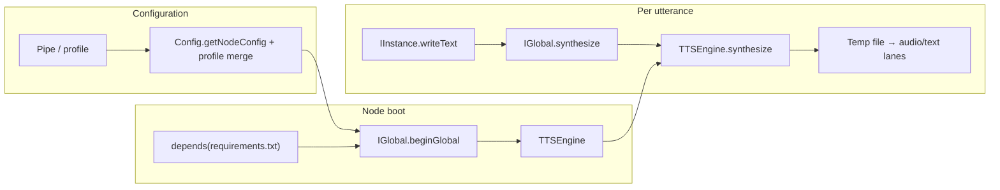
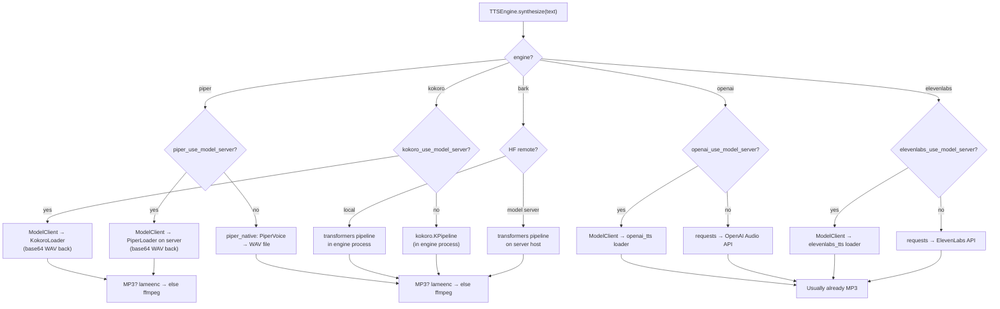
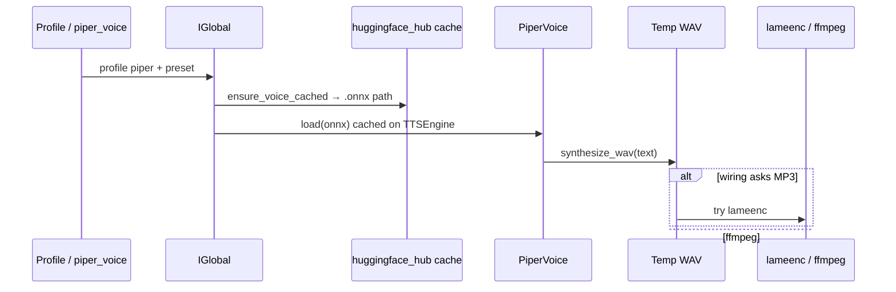
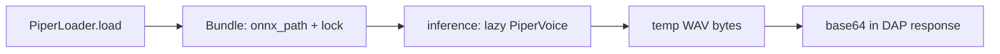

# `audio_tts` — Implementation summary (for Rod / reviewers)

This document describes how the **Text To Speech** RocketRide node is wired: configuration, dependencies, runtime paths, and how audio reaches downstream lanes.

---

## Goals

- **Curated UI:** Every profile uses **dropdowns** (`services.json` enums) for models/voices — no free-text Hub/API ids in the form for normal use.
- **Pip-managed deps:** `beginGlobal` calls **`depends(requirements.txt)`** so the engine installs declared packages for this node (same pattern as other nodes).
- **In-process synthesis where possible:** Piper uses **`piper.PiperVoice`**. **Bark** uses **`transformers` pipeline** (`text-to-audio`). **Kokoro** uses **`kokoro.KPipeline`**. Cloud engines use **`requests`**.
- **MP3 without mandatory system ffmpeg:** Prefer **`lameenc`** (LAME in-process). Fallback: **`ffmpeg`** subprocess using **`imageio-ffmpeg`**’s bundled binary or `PATH`.
- **`--modelserver`:** When set, engines that have loaders are proxied through the **model server** (DAP); the node does not expose a separate “use model server” toggle.
- **GPU + downloads:** With **`--modelserver`**, **Bark** and **Kokoro** (and Piper/OpenAI/ElevenLabs where proxied) load on the **model server**. Without **`--modelserver`**, local engines download on the **engine** host.

### Model placement rule (every profile)

| Mode                                                        | Where the engine runs                                                                                                    | GPU / downloads                                                                                                                                                                                                                                      |
| ----------------------------------------------------------- | ------------------------------------------------------------------------------------------------------------------------ | ---------------------------------------------------------------------------------------------------------------------------------------------------------------------------------------------------------------------------------------------------- |
| **No model server** (`get_model_server_address()` is unset) | Pipeline engine host (often “local”)                                                                                     | Each engine picks CPU vs GPU on **that** host; Hub / Piper / Kokoro caches download **there** on first use.                                                                                                                                          |
| **`--modelserver` active** (address is set)                 | Same engine process, but TTS **weights and voice files** are not loaded from Hub/cache in the node for supported engines | **Per profile:** Piper → `PiperLoader`; **Bark** → `transformers` `PipelineProxy`; Kokoro → `KokoroLoader`; OpenAI/ElevenLabs → cloud loaders when proxied. The engine still runs `depends(requirements.txt)` (pip packages for codecs/client code). |

CLI flag name in deployments is typically **`--modelserver`** (one word); behavior is “if a model-server endpoint is configured, route downloadable models there.”

---

## Layout (main files)

| Piece                                              | Role                                                                                                               |
| -------------------------------------------------- | ------------------------------------------------------------------------------------------------------------------ |
| `services.json`                                    | Profiles, enums, `preconfig`, conditional forms (`audio_tts.form.*`).                                              |
| `IGlobal.py`                                       | `depends(requirements.txt)`, merge profile config → `TTSEngine` config, Piper Hub cache path when local.           |
| `tts_engine.py`                                    | Dispatch by `engine`: Piper / Kokoro / Bark / OpenAI / ElevenLabs; MP3 transcoding; optional model-server clients. |
| `piper_catalog.py`                                 | Thin re-export of Hub cache for Piper ONNX voices.                                                                 |
| `piper_native.py` (under `ai.common.models.audio`) | `PiperVoice.load` + `synthesize_wav` to file.                                                                      |
| `wav_to_mp3.py` (under `ai.common.models.audio`)   | `lameenc` WAV→MP3; boolean “try” for fallback.                                                                     |
| `piper_loader.py` (model server)                   | Lazy **`PiperVoice`** per loaded model; inference writes temp WAV in-process.                                      |
| `kokoro_loader.py` (model server)                  | **`KPipeline`** per `lang_code` / repo; GPU via `allocate_gpu`; WAV base64 like Piper.                             |
| `requirements.txt`                                 | Single manifest for the node’s pip installs (see table below).                                                     |

---

## `requirements.txt` (what gets installed via `depends`)

| Dependency             | Used by                                                                                                         |
| ---------------------- | --------------------------------------------------------------------------------------------------------------- |
| `requests`, `numpy`    | HTTP TTS, array handling                                                                                        |
| `huggingface_hub`      | Piper voice cache / Hub                                                                                         |
| `piper-tts`            | Piper **`PiperVoice`** (ONNX + espeak data in package)                                                          |
| `transformers`         | Bark **`pipeline(..., task='text-to-audio')`**                                                                  |
| `kokoro`, `soundfile`  | Kokoro **`KPipeline`** (Kokoro-82M weights via `kokoro` PyPI)                                                   |
| `en_core_web_sm` wheel | Kokoro EN G2P (**misaki** / **spaCy**); avoids `spacy.cli.download` → **wasabi** `sys.exit(1)` (“Exception: 1”) |
| `lameenc`              | MP3 encoding without external ffmpeg when possible                                                              |
| `imageio-ffmpeg`       | Locate bundled **ffmpeg** for fallback transcoding                                                              |

**PyTorch** is **not** pinned here: it is expected from the **engine / model-server** image (same as other HF nodes).

---

## High-level flow

---

## Engine dispatch (local vs model server)

---

## Piper (local) — detail

---

## Model server Piper loader

---

## Rod review checklist (suggested)

- **End-to-end:** Form → merged config → `IGlobal` → `TTSEngine` / model server → `IInstance` lanes (audio PCM + text JSON base64).
- **Regression:** Old pipes with legacy `model`/`voice` keys should still merge via `_resolve_tts_model` / `_resolve_tts_voice`.
- **Fallback:** MP3 path tries `lameenc` first; exotic WAV formats may still need ffmpeg.
- **Cross-platform:** `lameenc` ships wheels for common platforms; ffmpeg fallback uses `imageio-ffmpeg` or system `PATH`.
- **Optional features:** Without `--modelserver`, HF/Piper run in the engine host; with it, loaders run where the model server is started.

---

## References

- Node README: `README.md` in this folder.
- Service definition: `services.json`.
- Model server Piper deps: `packages/ai/src/ai/common/models/audio/requirements_piper.txt`.
