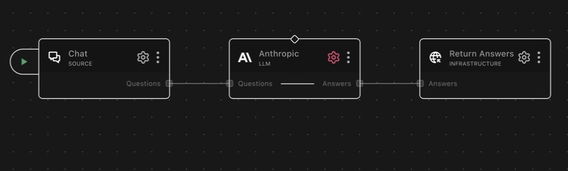

# llm_anthropic

A RocketRide LLM node that connects Anthropic's Claude models to your pipeline.

## About Anthropic

Anthropic is an AI safety company and the maker of the Claude family of large
language models. Claude models are widely used for reasoning, long-context
analysis, conversational AI, and code generation.

## What it does

Connects Anthropic's Claude models to your pipeline. Used primarily as an `llm`
invoke connection by agents, vector stores, database nodes, and other nodes that
need an LLM (`classType: ["llm"]`, capability `invoke`). Can also be used directly
in a pipeline via lanes.

Built on **langchain-anthropic** (`ChatAnthropic`) with the **anthropic** SDK used
directly for save-time validation. The configured `modelOutputTokens` is passed to
the model as `max_tokens`. Token counts for budgeting are estimated at roughly
4 characters per token.

## Example pipelines

**Direct question answering**

`chat → llm_anthropic → response_answers`

Questions arrive from chat and Claude's answers stream to the answers
response.

**LLM for an agent**

`webhook → agent_rocketride → response`, with this node connected to the
agent's `llm` channel. The agent uses Claude for its reasoning and tool
calling; swap profiles to trade cost against capability without touching the
pipeline.

**SQL generation for a database node**

`webhook → db_postgres → response`, with this node on the database node's
`llm` channel. Claude translates natural-language questions into SQL that the
database node validates and executes.

## Lanes

| Lane in     | Lane out  | Description                                           |
| ----------- | --------- | ----------------------------------------------------- |
| `questions` | `answers` | Send a question directly, receive a generated answer  |

## Profiles

Default profile: **Claude Sonnet 4.6**.

| Profile                            | Model ID               | Context tokens     | Output tokens |
| ---------------------------------- | ---------------------- | ------------------ | ------------- |
| Claude Sonnet 4.6 _(default)_      | `claude-sonnet-4-6`    | 1,000,000          | 128,000       |
| Claude Opus 4.6                    | `claude-opus-4-6`      | 1,000,000          | 128,000       |
| Claude Haiku 4.5                   | `claude-haiku-4-5`     | 200,000            | 64,000        |
| Claude Sonnet 4.5                  | `claude-sonnet-4-5`    | 1,000,000          | 64,000        |
| Claude Opus 4.5                    | `claude-opus-4-5`      | 200,000            | 64,000        |
| Claude Opus 5                      | `claude-opus-5`        | 1,000,000          | 128,000       |
| Claude Opus 5 (Fast)               | `claude-opus-5-fast`   | 1,000,000          | 128,000      |
| Anthropic: Claude Fable 5          | `claude-fable-5`       | 1,000,000          | 128,000       |
| Anthropic: Claude Sonnet 5         | `claude-sonnet-5`      | 1,000,000          | 128,000       |
| Anthropic: Claude Opus 4.8         | `claude-opus-4-8`      | 1,000,000          | 128,000       |
| Anthropic: Claude Opus 4.8 (Fast)  | `claude-opus-4-8-fast` | 1,000,000          | 128,000       |
| Anthropic: Claude Opus 4.7         | `claude-opus-4-7`      | 1,000,000          | 128,000       |
| Anthropic: Claude Opus 4.7 (Fast)  | `claude-opus-4-7-fast` | 1,000,000          | 128,000       |
| Anthropic: Claude Opus 4.1         | `claude-opus-4-1`      | 200,000            | 32,000        |
| Anthropic: Claude Opus 4           | `claude-opus-4`        | 200,000            | 32,000        |
| Anthropic: Claude Sonnet 4         | `claude-sonnet-4`      | 1,000,000          | 64,000        |
| Anthropic: Claude 3 Haiku          | `claude-3-haiku`       | 200,000            | 4,096         |
| Anthropic: Claude Fable Latest     | `claude-fable-latest`  | 1,000,000          | 128,000       |
| Anthropic: Claude Opus Latest      | `claude-opus-latest`   | 1,000,000          | 128,000       |
| Anthropic Claude Sonnet Latest     | `claude-sonnet-latest` | 1,000,000          | 128,000       |
| Anthropic Claude Haiku Latest      | `claude-haiku-latest`  | 200,000            | 64,000        |
| Custom                             | _(user-specified)_     | 200,000 (editable) | _(none set)_  |

The `*-latest` profiles track Anthropic's current model aliases and update as
Anthropic promotes new versions; pin a specific profile when reproducibility
matters.

## Configuration

Pick a profile and provide an API key — that is the whole configuration for
most pipelines. The model ID and token limits for named profiles are fixed by
the profile; only the `custom` profile exposes `model` and `modelTotalTokens`
directly. `modelSource` records where a custom model definition comes from
(`manual` or `openrouter`).

### Extended thinking

The `extendedThinking` toggle (off by default) requests the model's reasoning
stream. Two switches must both be on for thinking to activate: the model's
`capabilities.reasoning` flag (stamped from OpenRouter model sync) and this
node's toggle. It affects the interactive streaming path only — the agent /
`expectJson` path never requests thinking. Provider-correct parameters are
chosen by model; see Notes for the exact per-model behavior.

## Authentication

Provide an Anthropic API key in the `apikey` field. The key is validated at
startup: it must be non-empty and start with `sk-ant` (covers both standard
`sk-ant-...` and newer `sk-ant-api03-...` formats). If the key fails this check,
the node raises `Invalid Anthropic API key format, please check your API key.`
The key is read at construction time and not stored by the node.

## Notes

### Extended thinking parameters by model

Routing prefixes such as `openrouter/anthropic/` are stripped before matching.

| Model                                  | Thinking parameters sent                                                                                                                                                                                                                      |
| -------------------------------------- | -------------------------------------------------------------------------------------------------------------------------------------------------------------------------------------------------------------------------------------------- |
| Legacy Claude 3 / 3.5 Haiku            | None. Those models have no extended thinking; sending parameters would return a 400. Haiku 4.5 and newer are not excluded and follow the row below.                                                                                            |
| `claude-opus-4-7` / `claude-opus-4-8` | `thinking: {type: "adaptive", display: "summarized"}` (adaptive thinking)                                                                                                                                                                    |
| Other Claude models                    | `thinking: {type: "enabled", budget_tokens: N}` plus the `interleaved-thinking-2025-05-14` beta header, where `N` is half the output-token limit (minimum 2,048, always below `max_tokens`). Skipped entirely if the output window is too small for a valid budget. |

When thinking is actually enabled, responses are streamed through the native
Anthropic Messages API handler (`ai.common.llm_native_stream`, provider
`anthropic`) so that thinking deltas (which LangChain drops) are preserved and
forwarded on the `thinking` SSE lane. Non-reasoning models stay on the default
LangChain streaming path.

### Save-time validation

When the node configuration is saved, a lightweight validation pass runs before
the first pipeline execution:

- Checks that `modelTotalTokens` (custom profile) is greater than 0.
- Sends a minimal one-token probe request (`max_tokens: 1`) to the configured
  model using the configured key.

Any failure (bad key, unknown model, rate limit, network error) is surfaced as a
concise single-line warning in the form `Error <status>: <type> - <message>`,
extracted from the API's structured error payload when available. Network or SDK
errors that carry no structured payload fall back to the raw exception message,
collapsed to a single line.

## Upstream docs

- [Anthropic API documentation](https://docs.anthropic.com/en/api)

---

<!-- ROCKETRIDE:GENERATED:PARAMS START -->
<!-- Generated by nodes:docs-generate. Do not edit by hand. -->

## Schema

| Field | Type | Description | Default |
|---|---|---|---|
| `anthropic.profile` | `string` | **Model** LLM model | `"claude-sonnet-4-6"` |
| `model` | `string` | **Model** Anthropic model |  |
| `modelTotalTokens` | `number` | **Tokens** Total Tokens |  |

## Dependencies

- `langchain-anthropic`
- `anthropic`
- `langchain-core`
- `langchain`

## Source

[<svg viewBox="0 0 16 16" width="15" height="15" fill="currentColor" aria-hidden="true" style="vertical-align:-0.15em;margin-right:0.35em"><path d="M8 0C3.58 0 0 3.58 0 8c0 3.54 2.29 6.53 5.47 7.59.4.07.55-.17.55-.38 0-.19-.01-.82-.01-1.49-2.01.37-2.53-.49-2.69-.94-.09-.23-.48-.94-.82-1.13-.28-.15-.68-.52-.01-.53.63-.01 1.08.58 1.23.82.72 1.21 1.87.87 2.33.66.07-.52.28-.87.51-1.07-1.78-.2-3.64-.89-3.64-3.95 0-.87.31-1.59.82-2.15-.08-.2-.36-1.02.08-2.12 0 0 .67-.21 2.2.82.64-.18 1.32-.27 2-.27.68 0 1.36.09 2 .27 1.53-1.04 2.2-.82 2.2-.82.44 1.1.16 1.92.08 2.12.51.56.82 1.27.82 2.15 0 3.07-1.87 3.75-3.65 3.95.29.25.54.73.54 1.48 0 1.07-.01 1.93-.01 2.2 0 .21.15.46.55.38A8.013 8.013 0 0016 8c0-4.42-3.58-8-8-8z"/></svg> View source](https://github.com/rocketride-org/rocketride-server/tree/develop/nodes/src/nodes/llm_anthropic)
<!-- ROCKETRIDE:GENERATED:PARAMS END -->
