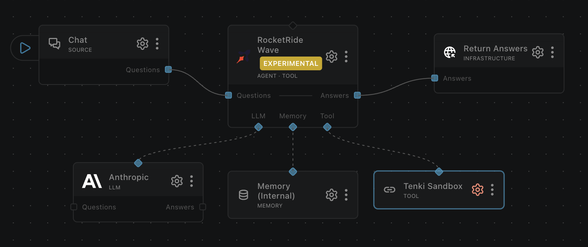

# tool_tenki

A RocketRide tool node that gives an agent a disposable Linux virtual machine to run commands and
code in, edit files, and work in a git repository. Pick it when an agent needs a real operating
system — installing packages, building, running a test suite — rather than an interpreter sandboxed
inside the engine's own process.

## About Tenki

Tenki Cloud runs Sandbox, a service that starts isolated Linux microVMs on demand and drives them
over an API. Each sandbox is a full virtual machine with its own kernel rather than a shared
container, so it behaves like an ordinary Linux host. An idle machine is paused rather than
destroyed, and resumes later with its files and memory intact.

## What it does

Gives the pipeline one sandbox session, created on the first tool call and shared by every call
after it, so files written and packages installed by one call are visible to the next. The agent
gets 11 functions in three groups: running commands and code, editing files under `/home/tenki`, and
working in a git repository. Pick it over `tool_python` when the work needs a real operating system
instead of a restricted interpreter, and over `tool_daytona` when you want a machine whose idle
state is paused rather than deleted. The node holds no credentials and places none inside the VM, so
`git_clone` reaches public repositories only.

## Example pipelines

**Write a script and run it in a sandbox**

`chat → agent_rocketride (+ tool_tenki) → response_answers`

<div align="center">



[](example.pipe)

</div>

A question arrives over chat. The agent writes a script into the sandbox, runs it, reads the real
output back, and answers from what actually happened rather than from what the code looks like it
would print. The sandbox is created on the agent's first tool call, so a conversation that never
needs one never starts a VM.

## As a tool

An agent addresses these as `<node id>.<function>`, for example `tool_tenki_1.run_command`. Which
functions are published depends on the **Tool groups** field; by default all three groups are.

| Function | Description |
|---|---|
| `run_command` | Run a shell command through a login shell, returning its exit code and output. |
| `run_code` | Write a snippet to a temporary file and run it with `python` or `javascript`. |
| `write_file` | Write a UTF-8 text file, creating parent directories as needed. |
| `read_file` | Read a UTF-8 text file back. |
| `list_files` | List a directory, optionally including hidden entries. |
| `make_directory` | Create a directory and its parents. |
| `delete_path` | Delete a file or directory recursively. |
| `git_clone` | Clone a public git repository into the sandbox. |
| `git_checkout` | Check out a branch, tag or commit, optionally creating the branch. |
| `git_diff` | Show a diff, optionally between two revisions or limited to one path. |
| `git_log` | Show commit history, bounded by a maximum count. |

Every path argument is resolved under `/home/tenki` and confined to it, so the file functions cannot
read or write elsewhere in the VM. Execution functions return `exit_code`, `stdout`, `stderr`,
`timed_out` and `truncated`; a command stopped at its timeout comes back as an ordinary result with
`timed_out` set, not as an error. Output longer than the configured cap is truncated before it
reaches the agent, with `truncated` set so the agent knows it did not see everything.

A call that had to recover the session first also carries a `session` field: `"resumed"` when the VM
had been paused and its files survived, or `"replaced"` when the old session had ended and this call
ran on a fresh, empty one. An agent that ignores that field can wrongly assume its earlier files are
still there.

## Configuration

Only the API key is required; every other field has a working default, and most pipelines never need
to change them. The ones worth understanding are the two that bound cost, the one that bounds a
single command, and the one that decides how much of the tool surface an agent sees.

### Tool groups

Which groups of functions the node publishes. Leave it empty to publish all three (`execution`,
`filesystem`, `git`). Naming groups publishes only those, which is how you hand an agent a narrower
surface: `["filesystem", "git"]` lets it read and edit a repository without letting it run commands.
A function that is not published is invisible to the agent and refused if it is called anyway. A
value naming only unknown groups stops the pipeline at startup rather than quietly falling back to
the default, so a typo surfaces immediately instead of widening access.

### Idle Timeout (minutes) and Max Duration (minutes)

These two bound cost, and Tenki enforces both, so they hold regardless of what the pipeline or the
engine does. The idle timeout **pauses** the session, which stops compute billing while preserving
files and memory; the next tool call resumes it. Max duration is a hard lifetime: when it elapses
the session ends for good, and the next call starts a fresh, empty one.

Size them as though they were the only cleanup, because in a chat-driven pipeline they effectively
are — see [Teardown](#teardown). A short idle timeout costs little, since a paused session resumes
in seconds, so keep it low unless an agent routinely pauses mid-task. Max duration bounds a single
session rather than total spend: a long-running pipeline that keeps working simply starts another
session once one ends.

### Execution Timeout (seconds)

The longest a single `run_command` or `run_code` may take. Tenki stops the command at that point and
reports it as a normal result with `timed_out` set. It also acts as the floor for the deadline on
calls to the Tenki API, which is never below 60 seconds, so raising it for a genuinely long build
also gives operations like `git_clone` more room.

## Authentication

The node needs a Tenki **workspace API key**, which begins with `tk_`. Create one in the Tenki
console under API Keys, then set it as the node's API Key field or reference it from the environment
as `${ROCKETRIDE_TENKI_APIKEY}` rather than writing the literal into a pipeline file.

The key authenticates the engine to Tenki and stays on the engine host. It is never placed inside the
sandbox, so nothing the agent runs can read it.

## Notes

### Tenancy

The session belongs to the pipeline, not to a user. A team-deployed pipeline is a single instance
serving every caller, so everyone using it shares one VM, its files and its installed packages.
Anything one conversation leaves behind is visible to the next, including a modified shell startup
file, which a login shell runs before every later command.

Run **one pipeline per user or per trust boundary**. The node cannot enforce that itself: a tool call
carries no caller identity, so it has no way to tell two callers apart.

### No git credentials

`git_clone` reaches public repositories only, by design. Tenki can inject a GitHub token into a
sandbox, but it arrives as an ordinary environment variable and the sandbox user has passwordless
`sudo`, so any command the agent runs could read it — and outbound networking is open, because
package installs need it. Rather than ship a secret that cannot be protected inside the machine it
is handed to, the node holds no git credentials at all.

### Session lifecycle

Tenki pauses an idle session rather than deleting it, and the node is built around that:

- **Paused** — memory and files under `/home/tenki` survive, but `/tmp` is cleared and open network
  connections drop. The next tool call resumes the session and retries automatically.
- **Ended** — past its max duration, or terminated. The next call starts a fresh, empty session, and
  earlier files and installed packages are gone.

Recovery follows the session's real state rather than the error that surfaced: a paused session is
resumed, an ended one is replaced, and anything else is reported to the agent unchanged. Because a
silent retry would let an agent assume its earlier work survived, a recovered call says what happened
in its `session` field, and a replacement is also logged as a warning, since it costs a new VM.

### Teardown

`endGlobal` closes the session and sweeps any session still carrying the run's unique tag — but the
engine does not always run node teardown. A pipeline sourced from `chat` or `webhook` is force-killed
when it is terminated and when its idle TTL expires; measured on engine 3.3.0 with a probe node, both
paths recorded `beginGlobal` and never `endGlobal`. For those pipelines the VM is not closed when the
pipeline stops: it runs until the idle timeout pauses it and max duration ends it. That is why those
two fields, rather than teardown, are the cleanup that counts.

Sessions are named `rocketride-tool-tenki-<suffix>` and tagged `rocketride`, so anything orphaned is
recognisable in the Tenki console and can be closed there.

### Running the tests

```bash
# Unit tests: the Tenki SDK is stubbed, so no API key and no network are needed
pytest nodes/test/test_tool_tenki.py -v

# Contract tests against the real SDK; skipped automatically when tenki is absent
pytest nodes/test/test_tool_tenki_sdk.py -v
```

The unit tests never call Tenki, because a real session costs real money. The contract tests check
the SDK names, signatures and defaults this node depends on, so a `tenki` release that renames one of
them fails there rather than in production.

## Upstream docs

- [Tenki Sandbox documentation](https://tenki.cloud/docs)
- [Tenki Cloud](https://tenki.cloud)

<!-- ROCKETRIDE:GENERATED:PARAMS START -->
<!-- Generated by nodes:docs-generate. Do not edit by hand. -->
<!-- ROCKETRIDE:GENERATED:PARAMS END -->
