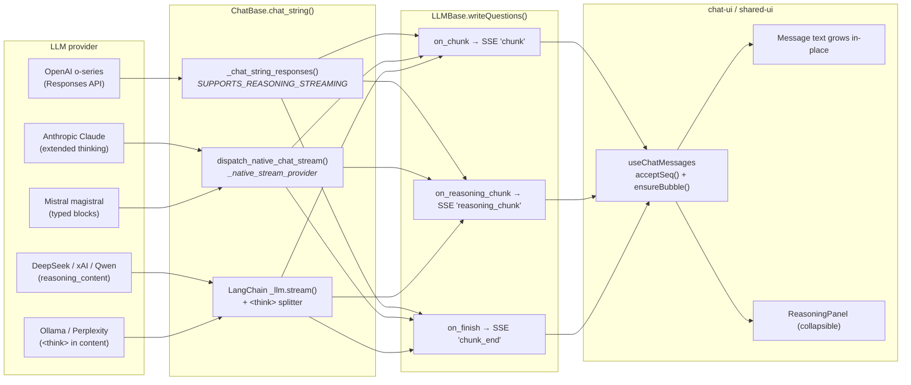

# LLM Streaming & Reasoning

How tokens — both the visible answer and the model's chain-of-thought — travel from a provider SDK to the chat UI as Server-Sent Events.

## Flow



## Three streaming paths (in dispatch order, `ChatBase.chat_string`)

| # | Gate | Used by |
|---|---|---|
| 1 | `SUPPORTS_REASONING_STREAMING=True` + `_raw_client.responses` | OpenAI o-series, gpt-5 family |
| 2 | `self._native_stream_provider` set (registered in `llm_native_stream.py`) | `anthropic` (extended thinking), `mistral` (magistral typed blocks), `openai_compat_reasoning` (DeepSeek, xAI, Qwen, Ollama-thinking, GMI Cloud) |
| 3 | Generic `_llm.stream()` loop with inline `<think>` splitter | Perplexity sonar-reasoning (CoT embedded in content), plain GPT-4, every other LangChain `ChatOpenAI` driver |

If a path raises or yields nothing the loop falls through to `_chat_with_retries(prompt)` (non-streaming) so the user still gets an answer.

### Why `openai_compat_reasoning` exists

`langchain-openai` (1.2.x) explicitly drops non-standard delta fields like `reasoning_content` from the streamed chunks. Providers that speak OpenAI Chat Completions but emit reasoning in that field (DashScope/Qwen, DeepSeek, xAI, GMI Cloud, Ollama thinking models) would lose their CoT going through LangChain. The handler bypasses LangChain by calling the raw `openai` SDK whose Pydantic models keep extra fields. Drivers opt in with three attributes set in `__init__`:

```python
from openai import OpenAI
self._raw_openai_client = OpenAI(api_key=..., base_url=...)
self._reasoning_kwargs = {'extra_body': {'enable_thinking': True}}  # provider-specific
self._native_stream_provider = 'openai_compat_reasoning'
```

## SSE event contract [per discussion #752](https://github.com/rocketride-org/rocketride-server/discussions/752#discussioncomment-16806337)

```jsonc
// chunk: visible answer token
{ "text": "...", "seq": 0, "runId": 42, "nodeId": "llm_openai_1", "ts": 1715... }

// reasoning_chunk: chain-of-thought / thinking-summary delta
{ "text": "...", "seq": 0, "runId": 42, "nodeId": "llm_openai_1", "ts": 1715... }

// reasoning_end: emitted once when reasoning_chunk stream is finished
{ "seq": 12, "runId": 42, "nodeId": "llm_openai_1", "ts": 1715... }

// chunk_end: final event, carries finishReason
{ "finishReason": "stop", "seq": 42, "runId": 42, "nodeId": "llm_openai_1" }
```

`seq` is per-stream-key (`runId:nodeId`); the UI uses `acceptSeq()` to drop out-of-order / duplicate deltas defensively (the engine guarantees order today).

## How each provider surfaces reasoning

| Provider | Source field | Driver flag | Notes |
|---|---|---|---|
| **OpenAI** o1/o3/o4/gpt-5 | `response.reasoning_summary_text.delta` | `SUPPORTS_REASONING_STREAMING` | Responses API; `reasoning.summary='auto'` |
| **Anthropic** claude-4-* | `thinking_delta` (Messages API) | `_native_stream_provider='anthropic'` | Extended-thinking models |
| **Mistral** magistral-2509+ | `content` typed block `{type:'thinking', thinking:[…]}` | `_native_stream_provider='mistral'` | New format; 2506 used `<think>` tags |
| **DeepSeek** deepseek-reasoner / r1 | `delta.reasoning_content` | `_native_stream_provider='openai_compat_reasoning'` | OpenAI-compatible Chat Completions; no extra params |
| **xAI** grok-4 / grok-3-mini | `delta.reasoning_content` | `_native_stream_provider='openai_compat_reasoning'` | `base_url='https://api.x.ai/v1'`; `reasoning_effort='low'` |
| **Qwen** qwen3, qwq, *-thinking | `delta.reasoning_content` | `_native_stream_provider='openai_compat_reasoning'` | DashScope `/compatible-mode/v1`; `extra_body={'enable_thinking': True}` |
| **GMI Cloud** deepseek-r1, qwen3-* | `delta.reasoning_content` | `_native_stream_provider='openai_compat_reasoning'` | Per-model auto-detect (`deepseek-r1` / `qwen3`) |
| **Ollama** deepseek-r1, qwen3, qwq | `delta.reasoning_content` *(via `reasoning_effort`)* | `_native_stream_provider='openai_compat_reasoning'` | `/v1/chat/completions` supports `reasoning_effort` per Ollama docs |
| **Perplexity** sonar-reasoning* | `<think>…</think>` in `content` | one-shot regex in `perplexity.py` override | Perplexity has no separate reasoning field per docs — CoT is always inline |

The `<think>` splitter is a stateful closure in `chat.py` (`_make_think_tag_splitter`) — it tolerates tags split across stream deltas and falls through transparently when no tags are present.

## Failure modes

- **Provider rejects streaming** → caught, `warning()` logged, falls back to non-streaming `_chat_with_retries`.
- **No `.stream()` on `_llm`** → skipped, falls back to `_chat_with_retries`.
- **`LLMBase.writeQuestions` raises** → emits an error chunk + `chunk_end{finishReason:'error'}` + fallback `Answer` so the chat-ui lane is never empty.

## Adding a new provider

1. If the provider streams via OpenAI-compatible Chat Completions and emits `reasoning_content` on deltas → opt into the `openai_compat_reasoning` native handler (raw `openai` SDK + `self._native_stream_provider = 'openai_compat_reasoning'`); `langchain-openai` strips the field.
2. If it uses `<think>` tags inline → **no change needed**, the splitter handles it.
3. If it needs the **Responses API**: set `SUPPORTS_REASONING_STREAMING = True`, set `self._is_reasoning` from the profile's `capabilities.reasoning`, and assign `self._raw_client` to an `OpenAI()`-compatible client in `__init__`.
4. If it needs a **custom SDK** (Anthropic/Mistral-style): write a handler in `llm_native_stream.py`, register it, and set `self._native_stream_provider = '<key>'` in the driver's `__init__`.
