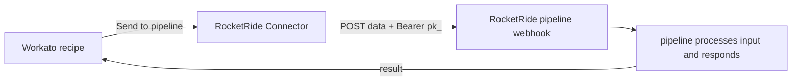

<p align="center"></p>

<h1 align="center">RocketRide Connector</h1>

A Workato custom connector that lets a Workato recipe **send data to a running RocketRide pipeline and get its output back**. Self-contained Ruby package built with the [`workato-connector-sdk`](https://docs.workato.com/developing-connectors/sdk.html) — the Workato counterpart to the n8n node (`packages/n8n-nodes`).

> In Workato it shows up as **"RocketRide Connector"** with the rocket icon.

## How it works

A RocketRide pipeline exposes an HTTP **webhook** while it is running (the engine prints its Webhook URL + auth key in the Endpoint Configuration). That webhook is the door into the pipeline: you `POST` data to it, the pipeline processes that input, and it returns the result **synchronously** in the response.

This connector wraps that door as a Workato action:



The user just configures **their own** Webhook URL + auth key once, then sends data and uses the result downstream in the recipe. RocketRide does the work; Workato orchestrates. Nothing runs the engine inside Workato.

> The pipeline must already be running/listening on its webhook. A local webhook (`localhost`) needs a public tunnel/domain before Workato can reach it; a webhook on a public domain/cloud works directly.

## What it provides

- **Connection** — Webhook URL + Authorization key (`pk_` public key or private token).
- **Actions** — one per pipeline lane; each POSTs with the matching `Content-Type` and returns the pipeline's `answers` synchronously:

  | Action | Lane | Content-Type |
  | --- | --- | --- |
  | **Ask a pipeline** | `questions` | `application/rocketride-question` (serialized `Question`) |
  | **Send text** | `text` | `text/plain` |
  | **Send file** | `image` / `audio` / `video` / `documents` | the file's MIME type (`image/png`, `audio/mpeg`, `application/pdf`, …) |

  The pipeline must wire the relevant lane to its processing nodes for an answer to come back.

## Example pipeline

`examples/rocketride-webhook.pipe` is a ready-to-run pipeline to test the connector end-to-end: `webhook → LlamaIndex agent → HTTP tool (catfact) → response_answers`. Run it in RocketRide, copy its **Webhook URL** + **`pk_`** into the connection, and call **Send to pipeline** with lane = `Question` — it returns a cat fact in `answer`.

## Develop & test locally

```bash
cd packages/workato-connector
bundle install

# configure local settings (copy the example, then encrypt)
cp settings.yaml.example settings.yaml
workato edit settings.yaml.enc      # creates master.key, encrypts your settings

# run the action against a real (tunneled) webhook
workato exec actions.send_to_pipeline.execute --input='{"payload":{"text":"hello"}}'

# unit tests
bundle exec rspec
```

## Push to a Workato workspace (for testing)

```bash
WORKATO_API_EMAIL=... WORKATO_API_TOKEN=... workato push
```

## CI/CD

- `.github/workflows/workato-connector-ci.yml` — runs RSpec on every change under this package.
- `.github/workflows/workato-connector-release.yml` — `workato push` on release (uses `WORKATO_API_EMAIL` / `WORKATO_API_TOKEN` secrets).

Publishing a new public version (Community Library / Partner Program) is a separate **release version** step; in the Partner Program each version goes through Workato code review.

## License

MIT — see [LICENSE](./LICENSE).
